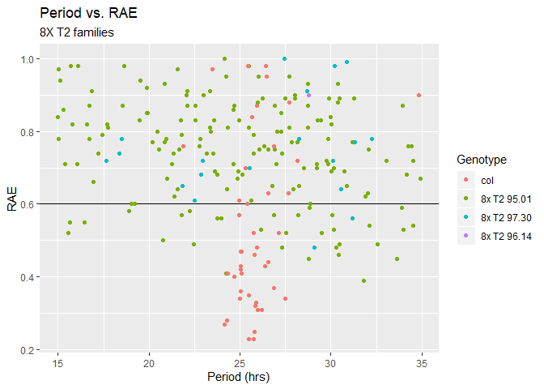
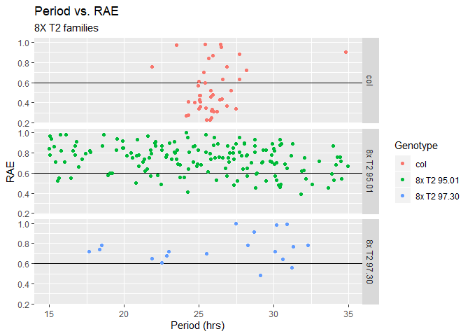

## Clock Assay Practice
### Dull 560 data
### Data collected by Cassandra and Mitchell

### Input aesthectics  
set to blue/green qualitative palette for now

```r
#set level and colors
clock_levels = c("col", "8x T2 95.01", "8x T2 97.30", "8x T2 96.14")
```

### Relative Expression plots  
load data  

```r
#load  
clock_data <- read_csv("Dull 560_All_Results.csv",
                     col_types = cols(
                       Genotype = col_factor()))
#str(clock_data)
```

Plot

```r
ggplot(clock_data, 
       aes(Period, RAE, color = Genotype)) + 
  geom_hline(yintercept = 0.6, color= "black") +
  geom_point() + 
  labs(title = "Period vs. RAE",
       subtitle = "8X T2 families",
       x = "Period (hrs)",
       y = "RAE",
       color = "Genotype") 
```

<!-- -->


```r
clock_summary = clock_data %>%
  filter(RAE<0.6) %>%
  select(Genotype, Period, RAE) %>%
  group_by(Genotype) %>%
  summarise(clock_mean = mean(Period)) %>%
  as.list()
```


```r
filter(clock_data, Genotype != "8x T2 96.14") %>%
ggplot(aes(Period, RAE, color = Genotype)) + 
  geom_hline(yintercept = 0.6, color= "black") +
  geom_point() + 
  labs(title = "Period vs. RAE",
       subtitle = "8X T2 families",
       x = "Period (hrs)",
       y = "RAE",
       color = "Genotype") +
  facet_grid(Genotype~.) 
```

<!-- -->

```r
#  annotate("text", x = 17, y = .35, label = clock_summary$clock_mean)

clock_summary$clock_mean
```

```
## [1] 25.57214 26.86806 30.15000
```

