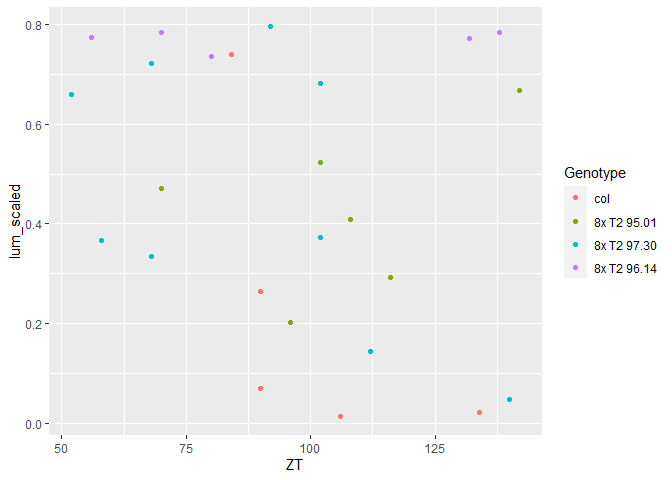
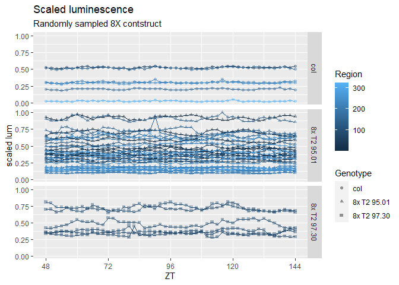
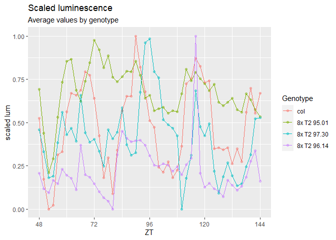

### Week 6 exercises

##### Dull560 LUC data set  
Graph time and luminescence for each genotype  
* Make sure data is formatted properly  
* Calculate the average luminescence of each genotype at each time point  
* Scale luminescence of all genotypes  
  + Universal background subtraction so trough values are close to 0 (subtract the same thing from all genotypes)  
  + Within each genotype, scale luminescence from 1 to 0 (so the peak = 1)  
  + Try this using *grouped functions* (grouped mutates/summaries)  
  + Also try this using *mapping loops* (from purrr) for comparison (or for loops if you’d prefer)  
* Make your graph - think about aesthetics  
* Optional: calculate standard error of luminescence of each genotype at each time point and use that to create error bars  
  

```r
clock_data <- read_csv("Dull 560_All_Results.csv",
                     col_types = cols(
                       Genotype = col_factor()))

clock_data <- select(clock_data, 1:6, 19:89)

head(clock_data)
```

```
## # A tibble: 6 x 77
##   Region Genotype Period Amplitude  Phase   RAE   `36`   `38`   `40`   `42`
##    <dbl> <fct>     <dbl>     <dbl>  <dbl> <dbl>  <dbl>  <dbl>  <dbl>  <dbl>
## 1    119 col        25.5     1087   10.4   0.23 6.77e4 6.78e4 6.85e4 6.86e4
## 2    325 col        25.7      748.  11.5   0.23 6.64e4 6.71e4 6.76e4 6.80e4
## 3    167 col        25.8     1355    9.56  0.25 9.08e4 9.31e4 9.18e4 9.21e4
## 4     73 col        24.1     1853    7.49  0.27 1.12e5 1.12e5 1.12e5 1.13e5
## 5    320 col        24.3     1224    9.2   0.28 8.97e4 8.98e4 9.08e4 9.15e4
## 6     71 col        26.0      896. -12.7   0.31 9.89e4 9.76e4 9.89e4 9.86e4
## # ... with 67 more variables: `44` <dbl>, `46` <dbl>, `48` <dbl>, `50` <dbl>,
## #   `52` <dbl>, `54` <dbl>, `56` <dbl>, `58` <dbl>, `60` <dbl>, `62` <dbl>,
## #   `64` <dbl>, `66` <dbl>, `68` <dbl>, `70` <dbl>, `72` <dbl>, `74` <dbl>,
## #   `76` <dbl>, `78` <dbl>, `80` <dbl>, `82` <dbl>, `84` <dbl>, `86` <dbl>,
## #   `88` <dbl>, `90` <dbl>, `92` <dbl>, `94` <dbl>, `96` <dbl>, `98` <dbl>,
## #   `100` <dbl>, `102` <dbl>, `104` <dbl>, `106` <dbl>, `108` <dbl>,
## #   `110` <dbl>, `112` <dbl>, `114` <dbl>, `116` <dbl>, `118` <dbl>,
## #   `120` <dbl>, `122` <dbl>, `124` <dbl>, `126` <dbl>, `128` <dbl>,
## #   `130` <dbl>, `132` <dbl>, `134` <dbl>, `136` <dbl>, `138` <dbl>,
## #   `140` <dbl>, `142` <dbl>, `144` <dbl>, `146` <dbl>, `148` <dbl>,
## #   `150` <dbl>, `152` <dbl>, `154` <dbl>, `156` <dbl>, `158` <dbl>,
## #   `160` <dbl>, `162` <dbl>, `164` <dbl>, `166` <dbl>, `168` <dbl>,
## #   `170` <dbl>, `172` <dbl>, `174` <dbl>, `176` <dbl>
```

```r
summary(clock_data$Genotype)
```

```
##         col 8x T2 95.01 8x T2 97.30 8x T2 96.14 
##          44         164          19           1
```

average lum, mins, and maxes at each timepoint by group

```r
clock_long <- clock_data %>%
  pivot_longer(cols = 7:77, names_to = "ZT", values_to = "lum")


clock_long$ZT <- sapply(clock_long$ZT, as.integer)

clock_ave_lum <- clock_long %>%
  group_by(Genotype, ZT) %>%
  summarise(average_lum = mean(lum, na.rm = T))

head(clock_ave_lum)
```

```
## # A tibble: 6 x 3
## # Groups:   Genotype [1]
##   Genotype    ZT average_lum
##   <fct>    <int>       <dbl>
## 1 col         36      79009.
## 2 col         38      79130.
## 3 col         40      79454.
## 4 col         42      79498.
## 5 col         44      79436.
## 6 col         46      79431.
```

Next, subtract universal background -> what is the lowest minimum?  

```r
min(clock_long$lum)
```

```
## [1] 64297.35
```

subtract universal background from all lum values

```r
clock_scaled <- clock_long %>%
  mutate(lum_background = lum - min(clock_long$lum))

summary(clock_scaled$lum_background)
```

```
##    Min. 1st Qu.  Median    Mean 3rd Qu.    Max. 
##       0  125368  272750  293785  456649  946507
```

find max values to scale to by genotype

```r
clock_scaled_geno <- clock_scaled %>%
  group_by(Genotype) %>%
  summarise(scaled_min = min(lum_background),
            scaled_max = max(lum_background))

clock_scaled_geno
```

```
## # A tibble: 4 x 3
##   Genotype    scaled_min scaled_max
##   <fct>            <dbl>      <dbl>
## 1 col                 0      57562.
## 2 8x T2 95.01     71706.    946506.
## 3 8x T2 97.30     17468.    369519.
## 4 8x T2 96.14     96180.    130719.
```

scale all values by genotype

```r
clock_scaled_final <- clock_scaled %>% 
  group_by(Genotype) %>%
  mutate(lum_scaled = lum_background / max(lum_background)) #this can't be right...

summary(clock_scaled_final$lum_scaled) 
```

```
##    Min. 1st Qu.  Median    Mean 3rd Qu.    Max. 
##  0.0000  0.2164  0.3722  0.3839  0.5215  1.0000
```


```r
clock_scaled_final %>%
  sample_n(10) %>%
  filter(ZT > 48 & ZT <144) %>%
  ggplot(aes(ZT, lum_scaled, color = Genotype)) +
  geom_point(a=.2)
```

```
## Warning: Ignoring unknown parameters: a
```

<!-- -->

ah yes... sampling doesn't work for this format. make a random sample list to use for filtering. 


```r
clock_samples <- clock_data %>% 
  sample_n(50)

clock_scaled_final %>%
  filter(ZT >= 48 & ZT <= 144) %>%
  filter(Region %in% clock_samples$Region) %>%
  ggplot(aes(ZT, lum_scaled, color = Region, shape = Genotype)) +
  geom_point(alpha =.4) +
  geom_line(aes(group  = Region)) +
  facet_grid(Genotype ~.) +
  labs(title = "Scaled luminescence",
       subtitle = "Randomly sampled 8X contstruct",
       x = "ZT",
       y = "scaled lum",
       shape = "Genotype") + 
  scale_fill_manual() + 
  scale_x_continuous(breaks = c(48, 72, 96, 120, 144))
```

<!-- -->

I'm supposed to be plotting averages....
scale the averaged by timepoint data

```r
clock_scaled_ave <- clock_ave_lum %>%
  mutate(ave_background = average_lum - min(average_lum)) %>%
  group_by(Genotype) %>%
  mutate(ave_scaled = ave_background / max(ave_background))

clock_scaled_ave %>%
  filter(ZT >= 48 & ZT <= 144) %>%
  ggplot(aes(ZT, ave_scaled, color = Genotype)) +
  geom_point(alpha =.4) +
  geom_line() +
  labs(title = "Scaled luminescence",
       subtitle = "Average values by genotype",
       x = "ZT",
       y = "scaled lum", 
       color = "Genotype") + 
  scale_fill_manual() + 
  scale_x_continuous(breaks = c(48, 72, 96, 120, 144))
```

<!-- -->

BITE ME
