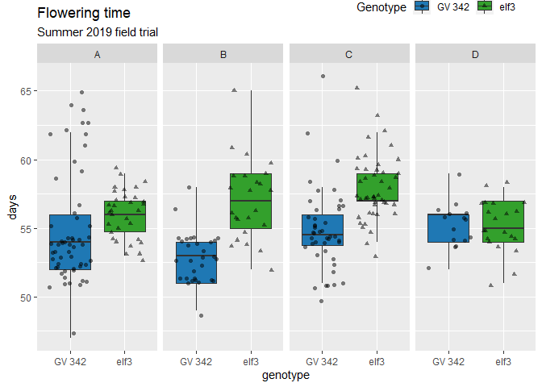
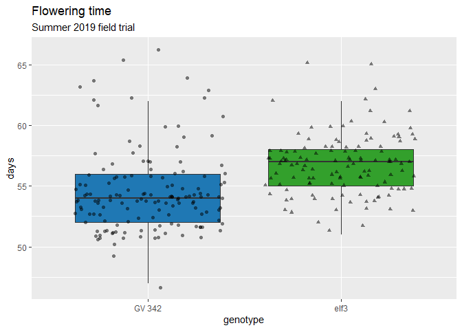
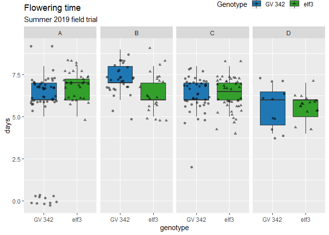
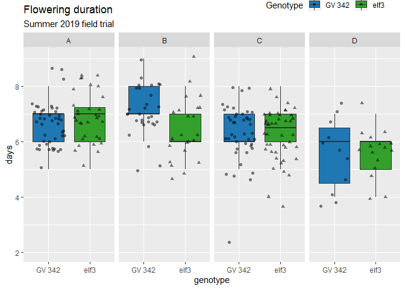
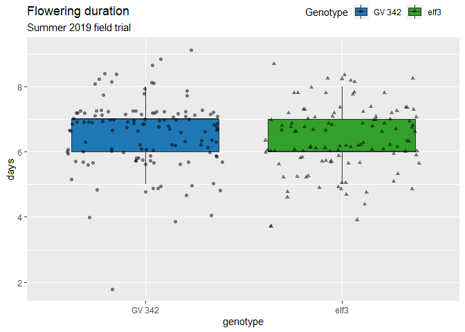
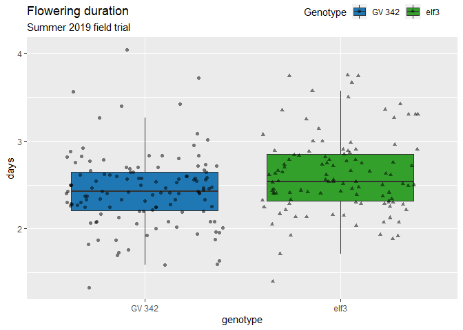
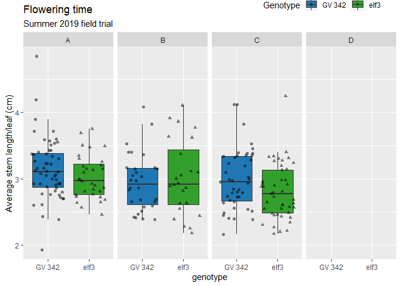
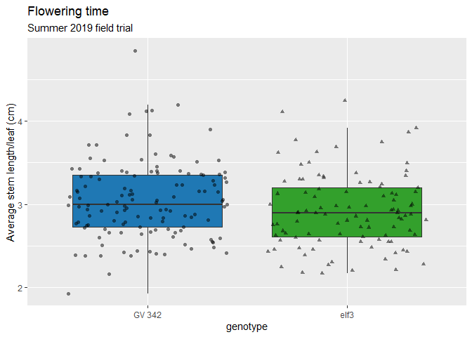
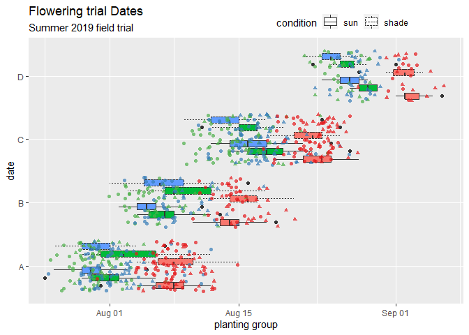

## Flowering Time  
### Field season 2019  
### analysis for Rundergrad club, spring 2020  

Outline:  
1. Set aesthecics  
2. Load data  
3. Plot  
4. Stat summary - coming soon!  

*Note*: when starting this document find/replace "FT" with appropriate experiment descriptor. Here I used "FT"  
Each coade chunk needs "r" indicator added as it is updated.  

### Input aesthectics  
Colors set to blue/green qualitative palette for now.  

```r
#edit to rename genotypes on the plots
FT_name_key = tibble(
  genotype = c("WT", "elf3"),
  new_geno = c("GV 342", "elf3")
)

#set level and colors
FT_levels = c("GV 342", "elf3")
FT_colors = c("GV 342" = "#1f78b4", 
              "elf3" = "#33a02c")
```

 
### load data  

```r
#load  
FT_data <- read_csv("master_flowering_time_Data_2020_05_01.csv",
                    locale = locale(date_format = "%m_%d_%Y"),
                     col_types = cols(
                       DNA_ID = col_character(),
                       field_ID = col_character(),
                       genotype = col_factor(),
                       group = col_factor(),
                       row = col_factor(),
                       `end?` = col_factor(),
                       condition = col_factor(),
                       germ = col_date(),
                       yellow = col_date(),
                       flowering = col_date(),
                       final = col_date(),
                       diameter = col_double(),
                       direction = col_character(),
                       height = col_double(),
                       leaf_num = col_double(),
                       ax_heads = col_double(),
                       notes = col_character()))

#rename genotypes  
FT_data = left_join(FT_data, FT_name_key, by = "genotype")
```

```
## Warning: Column `genotype` joining factor and character vector, coercing
## into character vector
```

```r
#relevel genotypes  
FT_data$new_geno = factor(FT_data$new_geno, levels = FT_levels)

#removed the NAs in flowering. this is peice of data we are most interested in!
FT_data = FT_data %>%
  filter(flowering != is.na(flowering))

summary(FT_data)
```

```
##     DNA_ID            field_ID           genotype         group 
##  Length:266         Length:266         Length:266         A:87  
##  Class :character   Class :character   Class :character   B:54  
##  Mode  :character   Mode  :character   Mode  :character   C:89  
##                                                           D:36  
##                                                                 
##                                                                 
##                                                                 
##       row         end?     condition        germ           
##  SUN_A  :45   end   : 35   sun  :130   Min.   :2019-06-07  
##  SH_A   :42   middle:231   shade:136   1st Qu.:2019-06-08  
##  SUN_C  :42                            Median :2019-06-15  
##  SH_C   :41                            Mean   :2019-06-17  
##  SH_B   :28                            3rd Qu.:2019-06-22  
##  SUN_B  :26                            Max.   :2019-07-04  
##  (Other):42                                                
##      yellow             flowering              final           
##  Min.   :2019-07-26   Min.   :2019-07-25   Min.   :2019-07-31  
##  1st Qu.:2019-08-01   1st Qu.:2019-08-03   1st Qu.:2019-08-09  
##  Median :2019-08-09   Median :2019-08-12   Median :2019-08-16  
##  Mean   :2019-08-09   Mean   :2019-08-11   Mean   :2019-08-17  
##  3rd Qu.:2019-08-16   3rd Qu.:2019-08-18   3rd Qu.:2019-08-24  
##  Max.   :2019-08-29   Max.   :2019-09-01   Max.   :2019-09-06  
##  NA's   :5                                 NA's   :12          
##     diameter      direction             height          leaf_num    
##  Min.   : 7.00   Length:266         Min.   : 54.00   Min.   :26.00  
##  1st Qu.:14.80   Class :character   1st Qu.: 86.35   1st Qu.:30.00  
##  Median :16.55   Mode  :character   Median : 94.35   Median :32.00  
##  Mean   :16.22                      Mean   : 96.56   Mean   :32.49  
##  3rd Qu.:18.07                      3rd Qu.:105.00   3rd Qu.:35.00  
##  Max.   :25.00                      Max.   :135.50   Max.   :43.00  
##  NA's   :20                         NA's   :36       NA's   :37     
##     ax_heads         notes             new_geno  
##  Min.   : 0.000   Length:266         GV 342:144  
##  1st Qu.: 2.000   Class :character   elf3  :122  
##  Median : 4.000   Mode  :character               
##  Mean   : 4.101                                  
##  3rd Qu.: 6.000                                  
##  Max.   :12.000                                  
##  NA's   :39
```

### Calculate new variables  
	Flowering time (days between germ and flowering)  
	Flowering duration (days between flowering and final)  
	Flowering rate (diameter / duration)  
	Leaf frequency (height/ leaves)  

```r
FT_data_full = FT_data %>%
  mutate(
    flowering_time = flowering - germ,
    flowering_duration = final - flowering,
    flowering_rate = diameter / as.double(flowering_duration),
    leaf_freq = height / leaf_num
  )

#there are 4 NAs in new_geno, investigate

summary(FT_data_full)
```

```
##     DNA_ID            field_ID           genotype         group 
##  Length:266         Length:266         Length:266         A:87  
##  Class :character   Class :character   Class :character   B:54  
##  Mode  :character   Mode  :character   Mode  :character   C:89  
##                                                           D:36  
##                                                                 
##                                                                 
##                                                                 
##       row         end?     condition        germ           
##  SUN_A  :45   end   : 35   sun  :130   Min.   :2019-06-07  
##  SH_A   :42   middle:231   shade:136   1st Qu.:2019-06-08  
##  SUN_C  :42                            Median :2019-06-15  
##  SH_C   :41                            Mean   :2019-06-17  
##  SH_B   :28                            3rd Qu.:2019-06-22  
##  SUN_B  :26                            Max.   :2019-07-04  
##  (Other):42                                                
##      yellow             flowering              final           
##  Min.   :2019-07-26   Min.   :2019-07-25   Min.   :2019-07-31  
##  1st Qu.:2019-08-01   1st Qu.:2019-08-03   1st Qu.:2019-08-09  
##  Median :2019-08-09   Median :2019-08-12   Median :2019-08-16  
##  Mean   :2019-08-09   Mean   :2019-08-11   Mean   :2019-08-17  
##  3rd Qu.:2019-08-16   3rd Qu.:2019-08-18   3rd Qu.:2019-08-24  
##  Max.   :2019-08-29   Max.   :2019-09-01   Max.   :2019-09-06  
##  NA's   :5                                 NA's   :12          
##     diameter      direction             height          leaf_num    
##  Min.   : 7.00   Length:266         Min.   : 54.00   Min.   :26.00  
##  1st Qu.:14.80   Class :character   1st Qu.: 86.35   1st Qu.:30.00  
##  Median :16.55   Mode  :character   Median : 94.35   Median :32.00  
##  Mean   :16.22                      Mean   : 96.56   Mean   :32.49  
##  3rd Qu.:18.07                      3rd Qu.:105.00   3rd Qu.:35.00  
##  Max.   :25.00                      Max.   :135.50   Max.   :43.00  
##  NA's   :20                         NA's   :36       NA's   :37     
##     ax_heads         notes             new_geno   flowering_time   
##  Min.   : 0.000   Length:266         GV 342:144   Length:266       
##  1st Qu.: 2.000   Class :character   elf3  :122   Class :difftime  
##  Median : 4.000   Mode  :character                Mode  :numeric   
##  Mean   : 4.101                                                    
##  3rd Qu.: 6.000                                                    
##  Max.   :12.000                                                    
##  NA's   :39                                                        
##  flowering_duration flowering_rate    leaf_freq    
##  Length:266         Min.   :1.333   Min.   :1.929  
##  Class :difftime    1st Qu.:2.277   1st Qu.:2.658  
##  Mode  :numeric     Median :2.507   Median :2.937  
##                     Mean   :  Inf   Mean   :2.991  
##                     3rd Qu.:2.785   3rd Qu.:3.300  
##                     Max.   :  Inf   Max.   :4.844  
##                     NA's   :20      NA's   :37
```


### Plotting  

```r
ggplot(FT_data_full, 
       aes(new_geno, flowering_time, 
           fill = new_geno, 
           shape = new_geno)) + 
  geom_boxplot(outlier.alpha = 0) +
  geom_point(alpha = 0.5, position = position_jitter()) +
  facet_grid(.~ group) +
  labs(title = "Flowering time",
       subtitle = "Summer 2019 field trial",
       x = "genotype",
       y = "days",
       fill = "Genotype",
       shape = "Genotype") +
  #theme(axis.text.x = element_text(angle = 65, vjust = .5)) +
  theme(legend.direction = "horizontal",
        legend.position = c(.8,1.2)) + #LOVE this
  #scale_y_continuous(breaks = c(2, 4, 6, 8, 10, 12, 14, 16, 18, 20, 22)) +
  #scale_color_manual(values = ) + 
  scale_fill_manual(values = FT_colors)
```

```
## Don't know how to automatically pick scale for object of type difftime. Defaulting to continuous.
```

<!-- -->

```r
FT_data_full %>%
  filter(new_geno == "GV 342") %>%
  filter(flowering_time > 60)
```

```
## # A tibble: 11 x 22
##    DNA_ID field_ID genotype group row   `end?` condition germ      
##    <chr>  <chr>    <chr>    <fct> <fct> <fct>  <fct>     <date>    
##  1 D203   SH_A_07  WT       A     SH_A  middle shade     2019-06-08
##  2 D220   SH_A_37  WT       A     SH_A  middle shade     2019-06-08
##  3 D221   SH_A_38  WT       A     SH_A  middle shade     2019-06-08
##  4 D223   SH_A_39  WT       A     SH_A  middle shade     2019-06-08
##  5 D224   SH_A_40  WT       A     SH_A  middle shade     2019-06-08
##  6 D226   SH_A_41  WT       A     SH_A  middle shade     2019-06-08
##  7 D229   SH_A_42  WT       A     SH_A  middle shade     2019-06-08
##  8 D230   SH_A_43  WT       A     SH_A  middle shade     2019-06-08
##  9 D233   SH_A_46  WT       A     SH_A  end    shade     2019-06-08
## 10 D400   SUN_C_12 WT       C     SUN_C middle sun       2019-06-22
## 11 D401   SUN_C_17 WT       C     SUN_C middle sun       2019-06-22
## # ... with 14 more variables: yellow <date>, flowering <date>,
## #   final <date>, diameter <dbl>, direction <chr>, height <dbl>,
## #   leaf_num <dbl>, ax_heads <dbl>, notes <chr>, new_geno <fct>,
## #   flowering_time <time>, flowering_duration <time>,
## #   flowering_rate <dbl>, leaf_freq <dbl>
```

super interesting that there are so many value over 60. Not sure what is going on with planting A WT. 


```r
ggplot(FT_data_full, 
       aes(new_geno, flowering_time, 
           fill = new_geno, 
           shape = new_geno)) + 
  geom_boxplot(outlier.alpha = 0) +
  geom_jitter(alpha = 0.5) +
  #facet_grid(.~ group) +
  labs(title = "Flowering time",
       subtitle = "Summer 2019 field trial",
       x = "genotype",
       y = "days",
       fill = "Genotype",
       shape = "Genotype") +
  #theme(axis.text.x = element_text(angle = 65, vjust = .5)) +
  theme(legend.direction = "horizontal",
      legend.position = c(.8,1.2)) +
  #scale_y_continuous(breaks = c(2, 4, 6, 8, 10, 12, 14, 16, 18, 20, 22)) +
  #scale_color_manual(values = ) + 
  scale_fill_manual(values = FT_colors)
```

```
## Don't know how to automatically pick scale for object of type difftime. Defaulting to continuous.
```

<!-- -->


```r
ggplot(FT_data_full, 
       aes(new_geno, flowering_duration, 
           fill = new_geno, 
           shape = new_geno)) + 
  geom_boxplot(outlier.alpha = 0) +
  geom_jitter(alpha = 0.5) +
  facet_grid(.~ group) +
  labs(title = "Flowering time",
       subtitle = "Summer 2019 field trial",
       x = "genotype",
       y = "days",
       fill = "Genotype",
       shape = "Genotype") +
  #theme(axis.text.x = element_text(angle = 65, vjust = .5)) +
  theme(legend.direction = "horizontal",
      legend.position = c(.8,1.2)) +
  #scale_y_continuous(breaks = c(2, 4, 6, 8, 10, 12, 14, 16, 18, 20, 22)) +
  #scale_color_manual(values = ) + 
  scale_fill_manual(values = FT_colors)
```

```
## Don't know how to automatically pick scale for object of type difftime. Defaulting to continuous.
```

```
## Warning: Removed 12 rows containing non-finite values (stat_boxplot).
```

```
## Warning: Removed 12 rows containing missing values (geom_point).
```

<!-- -->

What's with the baby group in planting A?


```r
FT_data_full %>%
  filter(flowering_duration < 2.5)
```

```
## # A tibble: 12 x 22
##    DNA_ID field_ID genotype group row   `end?` condition germ      
##    <chr>  <chr>    <chr>    <fct> <fct> <fct>  <fct>     <date>    
##  1 D219   SH_A_36  WT       A     SH_A  middle shade     2019-06-08
##  2 D220   SH_A_37  WT       A     SH_A  middle shade     2019-06-08
##  3 D221   SH_A_38  WT       A     SH_A  middle shade     2019-06-08
##  4 D223   SH_A_39  WT       A     SH_A  middle shade     2019-06-08
##  5 D224   SH_A_40  WT       A     SH_A  middle shade     2019-06-08
##  6 D226   SH_A_41  WT       A     SH_A  middle shade     2019-06-08
##  7 D229   SH_A_42  WT       A     SH_A  middle shade     2019-06-08
##  8 D230   SH_A_43  WT       A     SH_A  middle shade     2019-06-08
##  9 D231   SH_A_44  WT       A     SH_A  middle shade     2019-06-08
## 10 D232   SH_A_45  WT       A     SH_A  end    shade     2019-06-08
## 11 D233   SH_A_46  WT       A     SH_A  end    shade     2019-06-08
## 12 D401   SUN_C_17 WT       C     SUN_C middle sun       2019-06-22
## # ... with 14 more variables: yellow <date>, flowering <date>,
## #   final <date>, diameter <dbl>, direction <chr>, height <dbl>,
## #   leaf_num <dbl>, ax_heads <dbl>, notes <chr>, new_geno <fct>,
## #   flowering_time <time>, flowering_duration <time>,
## #   flowering_rate <dbl>, leaf_freq <dbl>
```

definitely an input error! oops! Let's filter first, then plot


```r
FT_data_full %>%
  filter(flowering_duration > 1) %>%
ggplot(aes(new_geno, flowering_duration, 
           fill = new_geno, 
           shape = new_geno)) + 
  geom_boxplot(outlier.alpha = 0) +
  geom_jitter(alpha = 0.5) +
  facet_grid(.~ group) +
  labs(title = "Flowering duration",
       subtitle = "Summer 2019 field trial",
       x = "genotype",
       y = "days",
       fill = "Genotype",
       shape = "Genotype") +
  #theme(axis.text.x = element_text(angle = 65, vjust = .5)) +
  theme(legend.direction = "horizontal",
      legend.position = c(.8,1.2)) +
  #scale_y_continuous(breaks = c(2, 4, 6, 8, 10, 12, 14, 16, 18, 20, 22)) +
  #scale_color_manual(values = ) + 
  scale_fill_manual(values = FT_colors)
```

```
## Don't know how to automatically pick scale for object of type difftime. Defaulting to continuous.
```

<!-- -->

B WT is interesting. Wonder if it was cloudy one of those days?  


```r
FT_data_full %>%
  filter(flowering_duration > 1) %>%
ggplot(aes(new_geno, flowering_duration, 
           fill = new_geno, 
           shape = new_geno)) + 
  geom_boxplot(outlier.alpha = 0) +
  geom_point(alpha = 0.5, position = position_jitter()) +
  #facet_grid(.~ group) +
  labs(title = "Flowering duration",
       subtitle = "Summer 2019 field trial",
       x = "genotype",
       y = "days",
       fill = "Genotype",
       shape = "Genotype") +
  #theme(axis.text.x = element_text(angle = 65, vjust = .5)) +
  theme(legend.direction = "horizontal",
      legend.position = c(.8,1.1)) + #my legend ran away on this one
  #scale_y_continuous(breaks = c(2, 4, 6, 8, 10, 12, 14, 16, 18, 20, 22)) +
  #scale_color_manual(values = ) + 
  scale_fill_manual(values = FT_colors)
```

```
## Don't know how to automatically pick scale for object of type difftime. Defaulting to continuous.
```

<!-- -->

snore.

For flowering rate we have the same filtering problems...

```r
FT_data_full %>%
  filter(flowering_rate <5) %>%
ggplot(aes(new_geno, flowering_rate, 
           fill = new_geno, 
           shape = new_geno)) + 
  geom_boxplot(outlier.alpha = 0) +
  geom_point(alpha = 0.5, position = position_jitter()) +
  facet_grid(.~ group) +
  labs(title = "Flowering duration",
       subtitle = "Summer 2019 field trial",
       x = "genotype",
       y = "days",
       fill = "Genotype",
       shape = "Genotype") +
  #theme(axis.text.x = element_text(angle = 65, vjust = .5)) +
  theme(legend.direction = "horizontal",
      legend.position = c(.8,1.2)) + #
  #scale_y_continuous(breaks = c(2, 4, 6, 8, 10, 12, 14, 16, 18, 20, 22)) +
  #scale_color_manual(values = ) + 
  scale_fill_manual(values = FT_colors)
```

<!-- -->


```r
FT_data_full %>%
  filter(flowering_rate <5) %>%
ggplot(aes(new_geno, flowering_rate, 
           fill = new_geno, 
           shape = new_geno)) + 
  geom_boxplot(outlier.alpha = 0) +
  geom_point(alpha = 0.5, position = position_jitter()) +
  #facet_grid(.~ group) +
  labs(title = "Flowering duration",
       subtitle = "Summer 2019 field trial",
       x = "genotype",
       y = "days",
       fill = "Genotype",
       shape = "Genotype") +
  #theme(axis.text.x = element_text(angle = 65, vjust = .5)) +
  theme(legend.direction = "horizontal",
      legend.position = c(.8,1.1)) + #my legend ran away on this one
  #scale_y_continuous(breaks = c(2, 4, 6, 8, 10, 12, 14, 16, 18, 20, 22)) +
  #scale_color_manual(values = ) + 
  scale_fill_manual(values = FT_colors)
```

<!-- -->


```r
ggplot(FT_data_full, 
       aes(new_geno, leaf_freq, 
           fill = new_geno, 
           shape = new_geno)) + 
  geom_boxplot(outlier.alpha = 0) +
  geom_jitter(alpha = 0.5) +
  facet_grid(.~ group) +
  labs(title = "Flowering time",
       subtitle = "Summer 2019 field trial",
       x = "genotype",
       y = "Average stem length/leaf (cm)",
       fill = "Genotype",
       shape = "Genotype") +
  #theme(axis.text.x = element_text(angle = 65, vjust = .5)) +
  theme(legend.direction = "horizontal",
      legend.position = c(.8,1.2)) +
  #scale_y_continuous(breaks = c(2, 4, 6, 8, 10, 12, 14, 16, 18, 20, 22)) +
  #scale_color_manual(values = ) + 
  scale_fill_manual(values = FT_colors)
```

```
## Warning: Removed 37 rows containing non-finite values (stat_boxplot).
```

```
## Warning: Removed 37 rows containing missing values (geom_point).
```

<!-- -->


```r
ggplot(FT_data_full, 
       aes(new_geno, leaf_freq, 
           fill = new_geno, 
           shape = new_geno)) + 
  geom_boxplot(outlier.alpha = 0) +
  geom_jitter(alpha = 0.5) +
  #facet_grid(.~ group) +
  labs(title = "Flowering time",
       subtitle = "Summer 2019 field trial",
       x = "genotype",
       y = "Average stem length/leaf (cm)",
       fill = "Genotype",
       shape = "Genotype") +
  #theme(axis.text.x = element_text(angle = 65, vjust = .5)) +
  theme(legend.direction = "horizontal",
      legend.position = c(.8,1.2)) +
  #scale_y_continuous(breaks = c(2:5)) +
  #scale_color_manual(values = ) + 
  scale_fill_manual(values = FT_colors)
```

```
## Warning: Removed 37 rows containing non-finite values (stat_boxplot).
```

```
## Warning: Removed 37 rows containing missing values (geom_point).
```

<!-- -->

### Challenge - pivot table  
Make a plot using pivot table that they can recreate...  


```r
str(FT_data_full)
```

```
## Classes 'spec_tbl_df', 'tbl_df', 'tbl' and 'data.frame':	266 obs. of  22 variables:
##  $ DNA_ID            : chr  "D132" "D133" "D134" "D136" ...
##  $ field_ID          : chr  "SUN_A_01" "SUN_A_02" "SUN_A_03" "SUN_A_09" ...
##  $ genotype          : chr  "WT" "WT" "WT" "WT" ...
##  $ group             : Factor w/ 4 levels "A","B","C","D": 1 1 1 1 1 1 1 1 1 1 ...
##  $ row               : Factor w/ 9 levels "SUN_A","SH_A",..: 1 1 1 1 1 1 1 1 1 1 ...
##  $ end?              : Factor w/ 2 levels "end","middle": 1 1 2 2 2 2 2 2 2 2 ...
##  $ condition         : Factor w/ 2 levels "sun","shade": 1 1 1 1 1 1 1 1 1 1 ...
##  $ germ              : Date, format: "2019-06-07" "2019-06-08" ...
##  $ yellow            : Date, format: "2019-07-30" "2019-07-30" ...
##  $ flowering         : Date, format: "2019-07-31" "2019-08-01" ...
##  $ final             : Date, format: "2019-08-07" "2019-08-08" ...
##  $ diameter          : num  18.6 17.9 15.4 19 13.5 9.8 16.1 16.8 16.3 19.7 ...
##  $ direction         : chr  "86" "66" "UP" "UP" ...
##  $ height            : num  93.7 91.1 77.5 87.6 80.2 54 72.7 87.4 89.2 91 ...
##  $ leaf_num          : num  32 33 28 30 33 28 28 28 29 31 ...
##  $ ax_heads          : num  8 4 8 9 4 11 8 8 7 6 ...
##  $ notes             : chr  NA NA NA NA ...
##  $ new_geno          : Factor w/ 2 levels "GV 342","elf3": 1 1 1 1 1 1 1 1 1 1 ...
##  $ flowering_time    : 'difftime' num  54 54 52 54 ...
##   ..- attr(*, "units")= chr "days"
##  $ flowering_duration: 'difftime' num  7 7 6 7 ...
##   ..- attr(*, "units")= chr "days"
##  $ flowering_rate    : num  2.66 2.56 2.57 2.71 2.25 ...
##  $ leaf_freq         : num  2.93 2.76 2.77 2.92 2.43 ...
```


```r
FT_data_small = FT_data_full[c(18,4, 6, 7, 9:11)]
str(FT_data_small)  
```

```
## Classes 'tbl_df', 'tbl' and 'data.frame':	266 obs. of  7 variables:
##  $ new_geno : Factor w/ 2 levels "GV 342","elf3": 1 1 1 1 1 1 1 1 1 1 ...
##  $ group    : Factor w/ 4 levels "A","B","C","D": 1 1 1 1 1 1 1 1 1 1 ...
##  $ end?     : Factor w/ 2 levels "end","middle": 1 1 2 2 2 2 2 2 2 2 ...
##  $ condition: Factor w/ 2 levels "sun","shade": 1 1 1 1 1 1 1 1 1 1 ...
##  $ yellow   : Date, format: "2019-07-30" "2019-07-30" ...
##  $ flowering: Date, format: "2019-07-31" "2019-08-01" ...
##  $ final    : Date, format: "2019-08-07" "2019-08-08" ...
```


```r
FT_gather = FT_data_small %>%
  gather( 
       key = "dev_stage", 
       value = "dev_date",
       yellow, flowering, final)
head(FT_gather)
```

```
## # A tibble: 6 x 6
##   new_geno group `end?` condition dev_stage dev_date  
##   <fct>    <fct> <fct>  <fct>     <chr>     <date>    
## 1 GV 342   A     end    sun       yellow    2019-07-30
## 2 GV 342   A     end    sun       yellow    2019-07-30
## 3 GV 342   A     middle sun       yellow    2019-07-29
## 4 GV 342   A     middle sun       yellow    2019-07-30
## 5 GV 342   A     middle sun       yellow    2019-07-30
## 6 GV 342   A     middle sun       yellow    NA
```


```r
ggplot(FT_gather, 
       aes(group, dev_date)) +
  geom_boxplot(aes(linetype = condition, 
                   fill = dev_stage),
               position = position_dodge2(padding = 0.2)) + #order matters!
  geom_point(aes(color = dev_stage, 
                 shape = new_geno),
                 alpha = 0.7, position = position_jitter()) +
  #facet_grid(.~ group) +
  labs(title = "Flowering trial Dates",
       subtitle = "Summer 2019 field trial",
       x = "date",
       y = "planting group") +
  #theme(axis.text.x = element_text(angle = 65, vjust = .5)) +
  theme(legend.direction = "horizontal",
      legend.position = c(.8,1.2)) +
  #scale_x_continuous(breaks = c(2, 4, 6, 8, 10, 12, 14, 16, 18, 20, 22)) +
  scale_color_brewer(palette = "Set1") +
  coord_flip()
```

```
## Warning: Removed 17 rows containing non-finite values (stat_boxplot).
```

```
## Warning: Removed 17 rows containing missing values (geom_point).
```

<!-- -->

### Troubleshooting  

Someone clearly has a date issue if they are -50 days to flowering...  
```
filter(FT_data_full, flowering_time < 30)
```

flowering is "2019_03_28", should be "2019_08_23" (probably??)

```
FT_data_full = mutate(FT_data_full, flowering = replace(flowering, flowering == "2019-03-28", "2019-08-23"))
```
