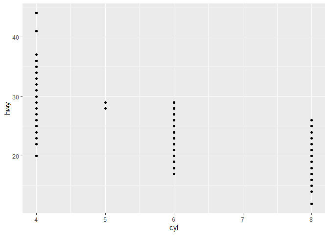
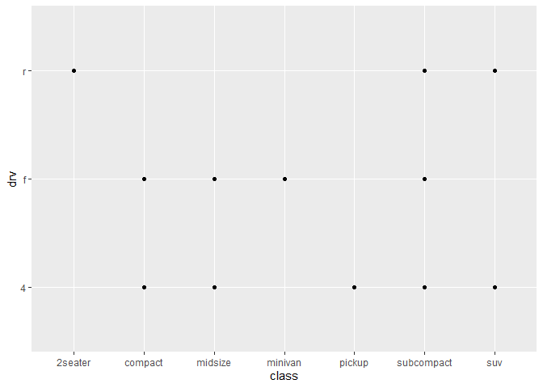
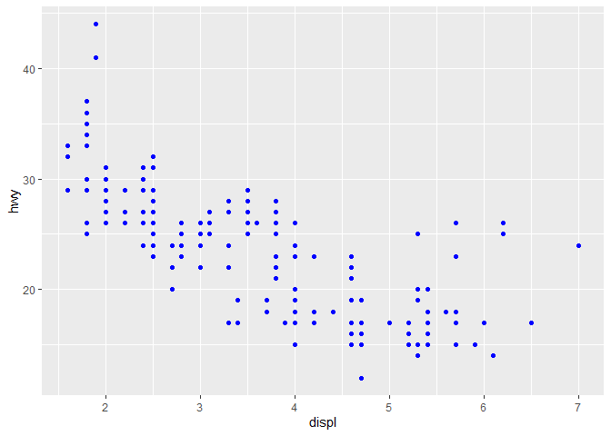
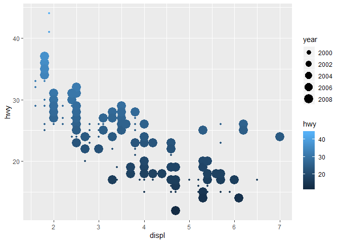
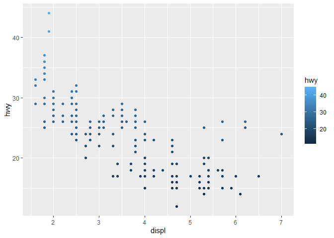
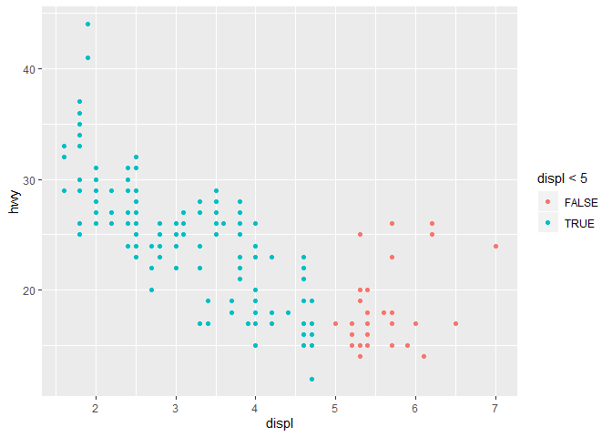

## Week of April 27  
R4DS Chapter 1 - Introduction to the book  
R4DS Chapter 2 - Introduction to Exploring data  
R4DS Chapter 3 - Data Visualization  
Read Sections 3.1 - 3.6 and 3.10 (3.7 - 3.9 are optional)  

### Complete the following problems  
3.2.4 Problems 1-5  
3.3.1 Problems 1-6  
3.5.1 Problems 1-6  
3.6.1 Problems 1-5 & select one graph from problem 6  

### 3.2.4 Problems 1 - 5  
#### 1

```r
ggplot(data = mpg)
```

<!-- -->

we get a blank plot, no aesthetics were defined.  
 
#### 2  

```r
nrow(mpg)
```

```
## [1] 234
```

```r
ncol(mpg)
```

```
## [1] 11
```
234 rows and 11 columns  

#### 3
checked the help file. drv describes drive. There are 3 factors, front wheel, rear wheel, and 4wd.  
#### 4  

```r
ggplot(data = mpg) +
  geom_point(aes(x= cyl, y = hwy))
```

<!-- -->

#### 5  

```r
ggplot(data = mpg) +
  geom_point(aes(x= class, y = drv))
```

<!-- -->
These are two  factors, so it doesn't show much but availible combinations.

### 3.3.1 Problems 1-6   
#### 1  

```r
ggplot(data = mpg) + 
  geom_point(mapping = aes(x = displ, y = hwy), color = "blue")
```

<!-- -->
Color if defines in aes wll become a variable. We want to change the actual color to blue, not define the variable blue so it must be outside the aes mapping.  

#### 2  

```r
summary(mpg)
```

```
##  manufacturer          model               displ            year     
##  Length:234         Length:234         Min.   :1.600   Min.   :1999  
##  Class :character   Class :character   1st Qu.:2.400   1st Qu.:1999  
##  Mode  :character   Mode  :character   Median :3.300   Median :2004  
##                                        Mean   :3.472   Mean   :2004  
##                                        3rd Qu.:4.600   3rd Qu.:2008  
##                                        Max.   :7.000   Max.   :2008  
##       cyl           trans               drv                 cty       
##  Min.   :4.000   Length:234         Length:234         Min.   : 9.00  
##  1st Qu.:4.000   Class :character   Class :character   1st Qu.:14.00  
##  Median :6.000   Mode  :character   Mode  :character   Median :17.00  
##  Mean   :5.889                                         Mean   :16.86  
##  3rd Qu.:8.000                                         3rd Qu.:19.00  
##  Max.   :8.000                                         Max.   :35.00  
##       hwy             fl               class          
##  Min.   :12.00   Length:234         Length:234        
##  1st Qu.:18.00   Class :character   Class :character  
##  Median :24.00   Mode  :character   Mode  :character  
##  Mean   :23.44                                        
##  3rd Qu.:27.00                                        
##  Max.   :44.00
```

categorical seem to be listed as character vectors, we could parse this differently to figure it out.  

#### 3  

```r
ggplot(data = mpg) + 
  geom_point(mapping = aes(x = displ, y = hwy, color = hwy, size = year))
```

<!-- -->
can't map a continuous variable to shape  

#### 4

```r
ggplot(data = mpg) + 
  geom_point(mapping = aes(x = displ, y = hwy, color = hwy))
```

<!-- -->
It uses both aesthetics.  

#### 5  
```
vignette("ggplot2-specs")
```  
stroke is the outline size of each point. it definitely works with shape 21, probably only outlined shapes  

#### 6  

```r
ggplot(data = mpg) + 
  geom_point(mapping = aes(x = displ, y = hwy, color = displ<5))
```

<!-- -->
labels by color given this argument.  


