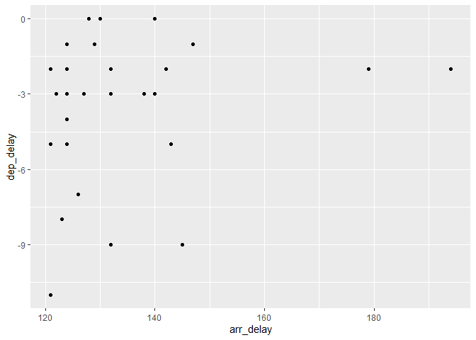
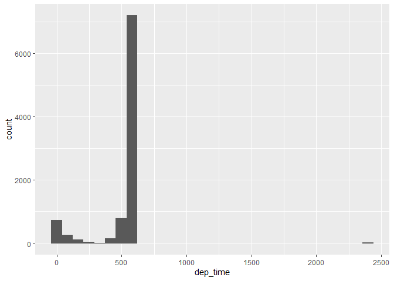

#### Week of May 4  
* R4DS Chapter 4 - Workflow: Basics (review of swirl stuff)  
* Read Sections 4.1 - 4.3  
  + Complete the problems in 4.4  
* R4DS Chapter 5 - Data Transformation  
  + Read 5.1 - 5.7  
* Complete the following problems  
  + 5.2.4 Problems 1.1, 1.4, 1.5, 1.7, 2 and 3  
  + 5.3.1 Problems 1-4  
  + 5.4.1 Problems 1-4  
  + 5.5.2 Problems 1-5  
  + 5.6.7 Problem 5  

### Chapter 4  

> But while you should expect to be a little frustrated, take comfort in that it’s both typical and temporary: it happens to everyone, and the only way to get over it is to keep trying.

**notes**  
* variable names are improtant  
* calling functions  

#### Problems 4.4  
Question 1. variable is spelled wrong when calling the object.  
Question 2. 


```r
ggplot(data = mpg) + # data spelled wrong
  geom_point(mapping = aes(x = displ, y = hwy))
```

<!-- -->

```r
filter(mpg, cyl == 8) #filter spelled wrong, = should be ==
```

```
## # A tibble: 70 x 11
##    manufacturer model displ  year   cyl trans drv     cty   hwy fl    class
##    <chr>        <chr> <dbl> <int> <int> <chr> <chr> <int> <int> <chr> <chr>
##  1 audi         a6 q~   4.2  2008     8 auto~ 4        16    23 p     mids~
##  2 chevrolet    c150~   5.3  2008     8 auto~ r        14    20 r     suv  
##  3 chevrolet    c150~   5.3  2008     8 auto~ r        11    15 e     suv  
##  4 chevrolet    c150~   5.3  2008     8 auto~ r        14    20 r     suv  
##  5 chevrolet    c150~   5.7  1999     8 auto~ r        13    17 r     suv  
##  6 chevrolet    c150~   6    2008     8 auto~ r        12    17 r     suv  
##  7 chevrolet    corv~   5.7  1999     8 manu~ r        16    26 p     2sea~
##  8 chevrolet    corv~   5.7  1999     8 auto~ r        15    23 p     2sea~
##  9 chevrolet    corv~   6.2  2008     8 manu~ r        16    26 p     2sea~
## 10 chevrolet    corv~   6.2  2008     8 auto~ r        15    25 p     2sea~
## # ... with 60 more rows
```

```r
filter(diamonds, carat > 3) #diamonds needed an s
```

```
## # A tibble: 32 x 10
##    carat cut     color clarity depth table price     x     y     z
##    <dbl> <ord>   <ord> <ord>   <dbl> <dbl> <int> <dbl> <dbl> <dbl>
##  1  3.01 Premium I     I1       62.7    58  8040  9.1   8.97  5.67
##  2  3.11 Fair    J     I1       65.9    57  9823  9.15  9.02  5.98
##  3  3.01 Premium F     I1       62.2    56  9925  9.24  9.13  5.73
##  4  3.05 Premium E     I1       60.9    58 10453  9.26  9.25  5.66
##  5  3.02 Fair    I     I1       65.2    56 10577  9.11  9.02  5.91
##  6  3.01 Fair    H     I1       56.1    62 10761  9.54  9.38  5.31
##  7  3.65 Fair    H     I1       67.1    53 11668  9.53  9.48  6.38
##  8  3.24 Premium H     I1       62.1    58 12300  9.44  9.4   5.85
##  9  3.22 Ideal   I     I1       62.6    55 12545  9.49  9.42  5.92
## 10  3.5  Ideal   H     I1       62.8    57 12587  9.65  9.59  6.03
## # ... with 22 more rows
```

Question 3. alt + shift + k brings up the keyboard shortcut menu. also found in Tools and Help.  

### Chapter 5  

**notes**  
* flights...  oh joy...  
* flights is a tibble, like a data frame but different. Pay attention to this in your own data!  
* ROWS are subset using FILTER()  
* logical operators  
  + & and  
  + | or  
  + ! not  
* %in% can help with confusing and statements  

#### Problems 5.2.4  
Problems 1.1, 1.4, 1.5, 1.7, 2 and 3  

Question 1.1 flights that had an arrival delay of two or more hours  

```r
filter(flights, arr_delay >= 120) %>%
  summary()
```

```
##       year          month             day           dep_time   
##  Min.   :2013   Min.   : 1.000   Min.   : 1.00   Min.   :   1  
##  1st Qu.:2013   1st Qu.: 4.000   1st Qu.: 8.00   1st Qu.:1540  
##  Median :2013   Median : 6.000   Median :16.00   Median :1908  
##  Mean   :2013   Mean   : 6.337   Mean   :15.68   Mean   :1736  
##  3rd Qu.:2013   3rd Qu.: 8.000   3rd Qu.:23.00   3rd Qu.:2129  
##  Max.   :2013   Max.   :12.000   Max.   :31.00   Max.   :2400  
##  sched_dep_time   dep_delay         arr_time    sched_arr_time
##  Min.   : 500   Min.   : -11.0   Min.   :   1   Min.   :   1  
##  1st Qu.:1429   1st Qu.: 131.0   1st Qu.: 237   1st Qu.:1558  
##  Median :1700   Median : 162.0   Median :1824   Median :1859  
##  Mean   :1603   Mean   : 176.5   Mean   :1411   Mean   :1765  
##  3rd Qu.:1901   3rd Qu.: 207.0   3rd Qu.:2147   3rd Qu.:2109  
##  Max.   :2359   Max.   :1301.0   Max.   :2400   Max.   :2359  
##    arr_delay        carrier              flight       tailnum         
##  Min.   : 120.0   Length:10200       Min.   :   1   Length:10200      
##  1st Qu.: 137.0   Class :character   1st Qu.: 581   Class :character  
##  Median : 163.0   Mode  :character   Median :1701   Mode  :character  
##  Mean   : 184.2                      Mean   :2261                     
##  3rd Qu.: 207.0                      3rd Qu.:4106                     
##  Max.   :1272.0                      Max.   :6177                     
##     origin              dest              air_time        distance     
##  Length:10200       Length:10200       Min.   : 22.0   Min.   :  80.0  
##  Class :character   Class :character   1st Qu.: 79.0   1st Qu.: 488.0  
##  Mode  :character   Mode  :character   Median :120.0   Median : 762.0  
##                                        Mean   :141.3   Mean   : 957.9  
##                                        3rd Qu.:167.0   3rd Qu.:1096.0  
##                                        Max.   :653.0   Max.   :4983.0  
##       hour           minute        time_hour                  
##  Min.   : 5.00   Min.   : 0.00   Min.   :2013-01-01 06:00:00  
##  1st Qu.:14.00   1st Qu.:10.00   1st Qu.:2013-04-19 04:00:00  
##  Median :17.00   Median :29.00   Median :2013-06-27 18:00:00  
##  Mean   :15.75   Mean   :27.37   Mean   :2013-06-26 16:30:56  
##  3rd Qu.:19.00   3rd Qu.:44.00   3rd Qu.:2013-08-13 17:15:00  
##  Max.   :23.00   Max.   :59.00   Max.   :2013-12-31 17:00:00
```

Question 1.4 Departed in summer (July, August, and September)  

```r
filter(flights, month %in% c(7:9)) %>%
  summary()
```

```
##       year          month            day           dep_time   
##  Min.   :2013   Min.   :7.000   Min.   : 1.00   Min.   :   1  
##  1st Qu.:2013   1st Qu.:7.000   1st Qu.: 8.00   1st Qu.: 904  
##  Median :2013   Median :8.000   Median :16.00   Median :1356  
##  Mean   :2013   Mean   :7.979   Mean   :15.88   Mean   :1346  
##  3rd Qu.:2013   3rd Qu.:9.000   3rd Qu.:23.00   3rd Qu.:1743  
##  Max.   :2013   Max.   :9.000   Max.   :31.00   Max.   :2400  
##                                                 NA's   :1878  
##  sched_dep_time   dep_delay          arr_time    sched_arr_time
##  Min.   : 106   Min.   : -26.00   Min.   :   1   Min.   :   1  
##  1st Qu.: 905   1st Qu.:  -5.00   1st Qu.:1051   1st Qu.:1115  
##  Median :1359   Median :  -1.00   Median :1523   Median :1550  
##  Mean   :1342   Mean   :  13.79   Mean   :1485   Mean   :1525  
##  3rd Qu.:1729   3rd Qu.:  11.00   3rd Qu.:1931   3rd Qu.:1938  
##  Max.   :2359   Max.   :1014.00   Max.   :2400   Max.   :2359  
##                 NA's   :1878      NA's   :2053                 
##    arr_delay        carrier              flight       tailnum         
##  Min.   : -68.0   Length:86326       Min.   :   1   Length:86326      
##  1st Qu.: -19.0   Class :character   1st Qu.: 583   Class :character  
##  Median :  -7.0   Mode  :character   Median :1543   Mode  :character  
##  Mean   :   6.4                      Mean   :1981                     
##  3rd Qu.:  13.0                      3rd Qu.:3395                     
##  Max.   :1007.0                      Max.   :6181                     
##  NA's   :2267                                                         
##     origin              dest              air_time        distance   
##  Length:86326       Length:86326       Min.   : 21.0   Min.   :  17  
##  Class :character   Class :character   1st Qu.: 79.0   1st Qu.: 502  
##  Mode  :character   Mode  :character   Median :122.0   Median : 833  
##                                        Mean   :146.2   Mean   :1054  
##                                        3rd Qu.:187.0   3rd Qu.:1400  
##                                        Max.   :640.0   Max.   :4983  
##                                        NA's   :2267                  
##       hour           minute       time_hour                  
##  Min.   : 1.00   Min.   : 0.0   Min.   :2013-07-01 05:00:00  
##  1st Qu.: 9.00   1st Qu.:10.0   1st Qu.:2013-07-23 19:00:00  
##  Median :13.00   Median :29.0   Median :2013-08-15 09:00:00  
##  Mean   :13.16   Mean   :26.8   Mean   :2013-08-15 18:22:37  
##  3rd Qu.:17.00   3rd Qu.:45.0   3rd Qu.:2013-09-07 16:00:00  
##  Max.   :23.00   Max.   :59.0   Max.   :2013-09-30 23:00:00  
## 
```

```r
#filter(flights, month == 7 | month == 8 | month == 9) %>%
#  summary()
```

Question 1.5 Arrived more than two hours late, but didn’t leave late  

```r
flights %>%
  filter(arr_delay > 120) %>%
  filter(dep_delay <= 0) %>%
  ggplot() +
  geom_point(aes(x = arr_delay, y = dep_delay))
```

<!-- -->

Question 1.7 Departed between midnight and 6am (inclusive)  

```r
flights %>%
  filter(dep_time == 2400 | dep_time <= 600) %>%
  ggplot() +
  geom_histogram(aes(x = dep_time))
```

```
## `stat_bin()` using `bins = 30`. Pick better value with `binwidth`.
```

<!-- -->

Question 2 Another useful dplyr filtering helper is between(). What does it do? Can you use it to simplify the code needed to answer the previous challenges?

Question 3 How many flights have a missing dep_time? What other variables are missing? What might these rows represent?  

```r
flights %>% filter(is.na(dep_delay))
```

```
## # A tibble: 8,255 x 19
##     year month   day dep_time sched_dep_time dep_delay arr_time
##    <int> <int> <int>    <int>          <int>     <dbl>    <int>
##  1  2013     1     1       NA           1630        NA       NA
##  2  2013     1     1       NA           1935        NA       NA
##  3  2013     1     1       NA           1500        NA       NA
##  4  2013     1     1       NA            600        NA       NA
##  5  2013     1     2       NA           1540        NA       NA
##  6  2013     1     2       NA           1620        NA       NA
##  7  2013     1     2       NA           1355        NA       NA
##  8  2013     1     2       NA           1420        NA       NA
##  9  2013     1     2       NA           1321        NA       NA
## 10  2013     1     2       NA           1545        NA       NA
## # ... with 8,245 more rows, and 12 more variables: sched_arr_time <int>,
## #   arr_delay <dbl>, carrier <chr>, flight <int>, tailnum <chr>,
## #   origin <chr>, dest <chr>, air_time <dbl>, distance <dbl>, hour <dbl>,
## #   minute <dbl>, time_hour <dttm>
```

seems like these were cancelled.  

#### Problems 5.3.1  
5.3.1 Problems 1-4  

Question 1. How could you use arrange() to sort all missing values to the start? (Hint: use is.na()).  

```r
flights %>% arrange(desc(is.na(dep_delay))) #needs desc()
```

```
## # A tibble: 336,776 x 19
##     year month   day dep_time sched_dep_time dep_delay arr_time
##    <int> <int> <int>    <int>          <int>     <dbl>    <int>
##  1  2013     1     1       NA           1630        NA       NA
##  2  2013     1     1       NA           1935        NA       NA
##  3  2013     1     1       NA           1500        NA       NA
##  4  2013     1     1       NA            600        NA       NA
##  5  2013     1     2       NA           1540        NA       NA
##  6  2013     1     2       NA           1620        NA       NA
##  7  2013     1     2       NA           1355        NA       NA
##  8  2013     1     2       NA           1420        NA       NA
##  9  2013     1     2       NA           1321        NA       NA
## 10  2013     1     2       NA           1545        NA       NA
## # ... with 336,766 more rows, and 12 more variables: sched_arr_time <int>,
## #   arr_delay <dbl>, carrier <chr>, flight <int>, tailnum <chr>,
## #   origin <chr>, dest <chr>, air_time <dbl>, distance <dbl>, hour <dbl>,
## #   minute <dbl>, time_hour <dttm>
```

Question 2. Sort flights to find the most delayed flights. Find the flights that left earliest.  

```r
flights %>% arrange(desc(dep_delay))
```

```
## # A tibble: 336,776 x 19
##     year month   day dep_time sched_dep_time dep_delay arr_time
##    <int> <int> <int>    <int>          <int>     <dbl>    <int>
##  1  2013     1     9      641            900      1301     1242
##  2  2013     6    15     1432           1935      1137     1607
##  3  2013     1    10     1121           1635      1126     1239
##  4  2013     9    20     1139           1845      1014     1457
##  5  2013     7    22      845           1600      1005     1044
##  6  2013     4    10     1100           1900       960     1342
##  7  2013     3    17     2321            810       911      135
##  8  2013     6    27      959           1900       899     1236
##  9  2013     7    22     2257            759       898      121
## 10  2013    12     5      756           1700       896     1058
## # ... with 336,766 more rows, and 12 more variables: sched_arr_time <int>,
## #   arr_delay <dbl>, carrier <chr>, flight <int>, tailnum <chr>,
## #   origin <chr>, dest <chr>, air_time <dbl>, distance <dbl>, hour <dbl>,
## #   minute <dbl>, time_hour <dttm>
```

Question 3. Sort flights to find the fastest (highest speed) flights.  

```r
#there isn't really a speed.... 
flights %>% 
  mutate(speed = distance / air_time) %>%
  arrange(desc(speed))
```

```
## # A tibble: 336,776 x 20
##     year month   day dep_time sched_dep_time dep_delay arr_time
##    <int> <int> <int>    <int>          <int>     <dbl>    <int>
##  1  2013     5    25     1709           1700         9     1923
##  2  2013     7     2     1558           1513        45     1745
##  3  2013     5    13     2040           2025        15     2225
##  4  2013     3    23     1914           1910         4     2045
##  5  2013     1    12     1559           1600        -1     1849
##  6  2013    11    17      650            655        -5     1059
##  7  2013     2    21     2355           2358        -3      412
##  8  2013    11    17      759            800        -1     1212
##  9  2013    11    16     2003           1925        38       17
## 10  2013    11    16     2349           2359       -10      402
## # ... with 336,766 more rows, and 13 more variables: sched_arr_time <int>,
## #   arr_delay <dbl>, carrier <chr>, flight <int>, tailnum <chr>,
## #   origin <chr>, dest <chr>, air_time <dbl>, distance <dbl>, hour <dbl>,
## #   minute <dbl>, time_hour <dttm>, speed <dbl>
```

Question 4. Which flights travelled the farthest? Which travelled the shortest?  

```r
flights %>% arrange(desc(distance)) %>% head()
```

```
## # A tibble: 6 x 19
##    year month   day dep_time sched_dep_time dep_delay arr_time
##   <int> <int> <int>    <int>          <int>     <dbl>    <int>
## 1  2013     1     1      857            900        -3     1516
## 2  2013     1     2      909            900         9     1525
## 3  2013     1     3      914            900        14     1504
## 4  2013     1     4      900            900         0     1516
## 5  2013     1     5      858            900        -2     1519
## 6  2013     1     6     1019            900        79     1558
## # ... with 12 more variables: sched_arr_time <int>, arr_delay <dbl>,
## #   carrier <chr>, flight <int>, tailnum <chr>, origin <chr>, dest <chr>,
## #   air_time <dbl>, distance <dbl>, hour <dbl>, minute <dbl>,
## #   time_hour <dttm>
```

```r
flights %>% arrange(distance) %>% head()
```

```
## # A tibble: 6 x 19
##    year month   day dep_time sched_dep_time dep_delay arr_time
##   <int> <int> <int>    <int>          <int>     <dbl>    <int>
## 1  2013     7    27       NA            106        NA       NA
## 2  2013     1     3     2127           2129        -2     2222
## 3  2013     1     4     1240           1200        40     1333
## 4  2013     1     4     1829           1615       134     1937
## 5  2013     1     4     2128           2129        -1     2218
## 6  2013     1     5     1155           1200        -5     1241
## # ... with 12 more variables: sched_arr_time <int>, arr_delay <dbl>,
## #   carrier <chr>, flight <int>, tailnum <chr>, origin <chr>, dest <chr>,
## #   air_time <dbl>, distance <dbl>, hour <dbl>, minute <dbl>,
## #   time_hour <dttm>
```

#### Problems 5.4.1  
5.4.1 Problems 1-4   

Question 1. Brainstorm as many ways as possible to select dep_time, dep_delay, arr_time, and arr_delay from flights.  

```r
times_not_sched = c("dep_time", "dep_delay", "arr_time", "arr_delay")
flights %>% select(one_of(times_not_sched))
```

```
## # A tibble: 336,776 x 4
##    dep_time dep_delay arr_time arr_delay
##       <int>     <dbl>    <int>     <dbl>
##  1      517         2      830        11
##  2      533         4      850        20
##  3      542         2      923        33
##  4      544        -1     1004       -18
##  5      554        -6      812       -25
##  6      554        -4      740        12
##  7      555        -5      913        19
##  8      557        -3      709       -14
##  9      557        -3      838        -8
## 10      558        -2      753         8
## # ... with 336,766 more rows
```

```r
flights %>% select(c(4, 6, 7, 9))
```

```
## # A tibble: 336,776 x 4
##    dep_time dep_delay arr_time arr_delay
##       <int>     <dbl>    <int>     <dbl>
##  1      517         2      830        11
##  2      533         4      850        20
##  3      542         2      923        33
##  4      544        -1     1004       -18
##  5      554        -6      812       -25
##  6      554        -4      740        12
##  7      555        -5      913        19
##  8      557        -3      709       -14
##  9      557        -3      838        -8
## 10      558        -2      753         8
## # ... with 336,766 more rows
```

Question 2. What happens if you include the name of a variable multiple times in a select() call?  

```r
flights %>% select(month, month) %>% head()
```

```
## # A tibble: 6 x 1
##   month
##   <int>
## 1     1
## 2     1
## 3     1
## 4     1
## 5     1
## 6     1
```

Question 3. What does the one_of() function do? Why might it be helpful in conjunction with this vector?  

```r
vars <- c("year", "month", "day", "dep_delay", "arr_delay")
flights %>% select(one_of(vars)) %>% head()
```

```
## # A tibble: 6 x 5
##    year month   day dep_delay arr_delay
##   <int> <int> <int>     <dbl>     <dbl>
## 1  2013     1     1         2        11
## 2  2013     1     1         4        20
## 3  2013     1     1         2        33
## 4  2013     1     1        -1       -18
## 5  2013     1     1        -6       -25
## 6  2013     1     1        -4        12
```

Question 4. Does the result of running the following code surprise you? How do the select helpers deal with case by default? How can you change that default?  

```r
select(flights, contains("TIME"))
```

```
## # A tibble: 336,776 x 6
##    dep_time sched_dep_time arr_time sched_arr_time air_time
##       <int>          <int>    <int>          <int>    <dbl>
##  1      517            515      830            819      227
##  2      533            529      850            830      227
##  3      542            540      923            850      160
##  4      544            545     1004           1022      183
##  5      554            600      812            837      116
##  6      554            558      740            728      150
##  7      555            600      913            854      158
##  8      557            600      709            723       53
##  9      557            600      838            846      140
## 10      558            600      753            745      138
## # ... with 336,766 more rows, and 1 more variable: time_hour <dttm>
```

```r
#contains is not case sensitive, weird
select(flights, contains("TIME", ignore.case = FALSE)) #ignore.case is an argument for contains, not select
```

```
## # A tibble: 336,776 x 0
```

#### Problems 5.5.2  
5.5.2 Problems 1-5  

Question 1. Currently dep_time and sched_dep_time are convenient to look at, but hard to compute with because they’re not really continuous numbers. Convert them to a more convenient representation of number of minutes since midnight.  

```r
flights %>%
  mutate(sched_dep_time_min = sched_dep_time %/% 100 *60 + sched_dep_time %% 100) %>%
  select(sched_dep_time, sched_dep_time_min) %>%
  arrange(sched_dep_time_min)
```

```
## # A tibble: 336,776 x 2
##    sched_dep_time sched_dep_time_min
##             <int>              <dbl>
##  1            106                 66
##  2            500                300
##  3            500                300
##  4            500                300
##  5            500                300
##  6            500                300
##  7            500                300
##  8            500                300
##  9            500                300
## 10            500                300
## # ... with 336,766 more rows
```

Question 2. Compare air_time with arr_time - dep_time. What do you expect to see? What do you see? What do you need to do to fix it?  

```r
flights %>%
  mutate(arr_minus_dep = arr_time - dep_time) %>%
  select(air_time, arr_minus_dep)
```

```
## # A tibble: 336,776 x 2
##    air_time arr_minus_dep
##       <dbl>         <int>
##  1      227           313
##  2      227           317
##  3      160           381
##  4      183           460
##  5      116           258
##  6      150           186
##  7      158           358
##  8       53           152
##  9      140           281
## 10      138           195
## # ... with 336,766 more rows
```
arr_time and dep_time need to be recalculated?  

Question 3. Compare dep_time, sched_dep_time, and dep_delay. How would you expect those three numbers to be related?

```r
flights %>%
  select(dep_time, sched_dep_time, dep_delay) %>%
  mutate(dep_time - sched_dep_time)
```

```
## # A tibble: 336,776 x 4
##    dep_time sched_dep_time dep_delay `dep_time - sched_dep_time`
##       <int>          <int>     <dbl>                       <int>
##  1      517            515         2                           2
##  2      533            529         4                           4
##  3      542            540         2                           2
##  4      544            545        -1                          -1
##  5      554            600        -6                         -46
##  6      554            558        -4                          -4
##  7      555            600        -5                         -45
##  8      557            600        -3                         -43
##  9      557            600        -3                         -43
## 10      558            600        -2                         -42
## # ... with 336,766 more rows
```

This has the same time calulation problems as the previous two

Question 4. Find the 10 most delayed flights using a ranking function. How do you want to handle ties? Carefully read the documentation for min_rank().  

```r
flights %>%
  mutate(delay_rank = min_rank(desc(dep_delay))) %>%
  select(dep_delay, delay_rank, everything()) %>%
  arrange(delay_rank)
```

```
## # A tibble: 336,776 x 20
##    dep_delay delay_rank  year month   day dep_time sched_dep_time arr_time
##        <dbl>      <int> <int> <int> <int>    <int>          <int>    <int>
##  1      1301          1  2013     1     9      641            900     1242
##  2      1137          2  2013     6    15     1432           1935     1607
##  3      1126          3  2013     1    10     1121           1635     1239
##  4      1014          4  2013     9    20     1139           1845     1457
##  5      1005          5  2013     7    22      845           1600     1044
##  6       960          6  2013     4    10     1100           1900     1342
##  7       911          7  2013     3    17     2321            810      135
##  8       899          8  2013     6    27      959           1900     1236
##  9       898          9  2013     7    22     2257            759      121
## 10       896         10  2013    12     5      756           1700     1058
## # ... with 336,766 more rows, and 12 more variables: sched_arr_time <int>,
## #   arr_delay <dbl>, carrier <chr>, flight <int>, tailnum <chr>,
## #   origin <chr>, dest <chr>, air_time <dbl>, distance <dbl>, hour <dbl>,
## #   minute <dbl>, time_hour <dttm>
```

Question 5. What does 1:3 + 1:10 return? Why?  
```{}
1:3 + 1:10
```
objects don't match lengths!  

```r
1:3 + 1:9
```

```
## [1]  2  4  6  5  7  9  8 10 12
```

#### Problems 5.6.7  

Question 5. Which carrier has the worst delays? Challenge: can you disentangle the effects of bad airports vs. bad carriers? Why/why not? (Hint: think about flights %>% group_by(carrier, dest) %>% summarise(n()))  

