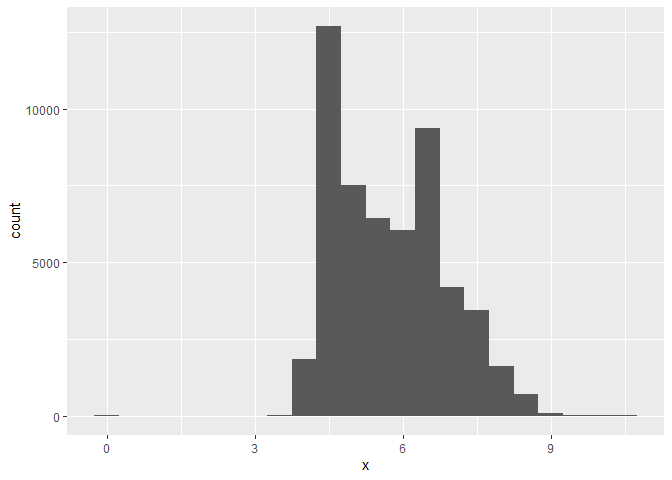
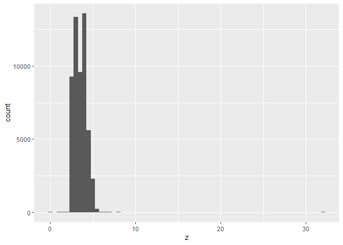
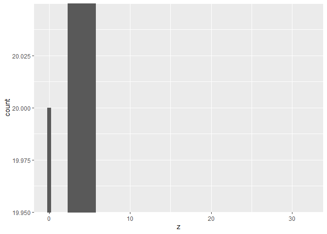
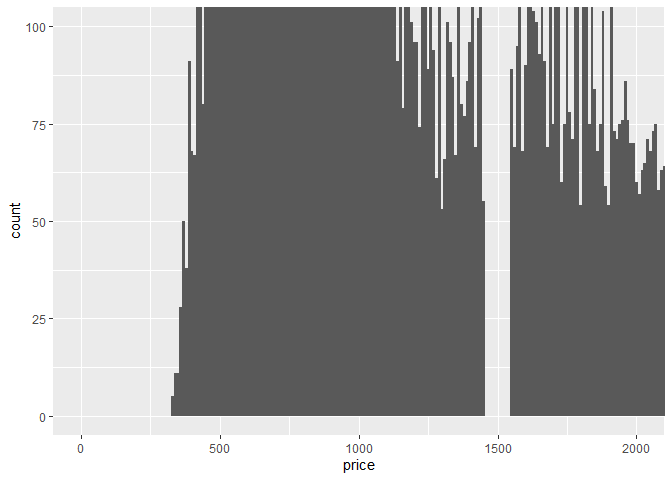
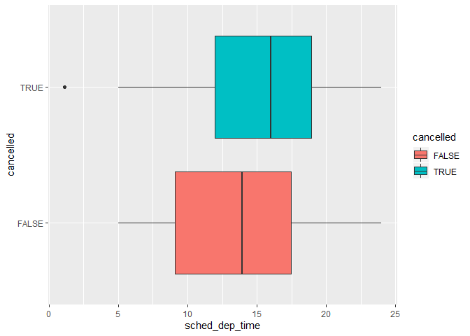
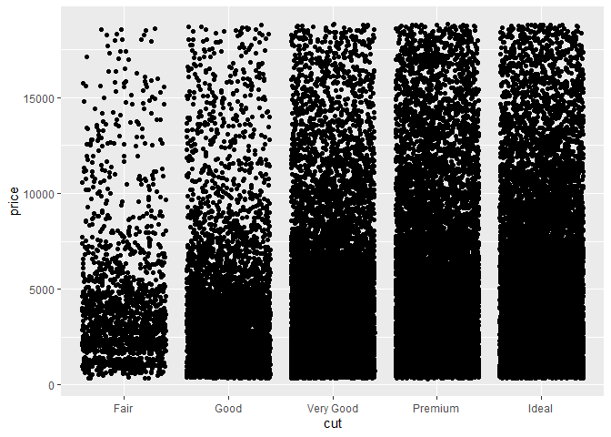
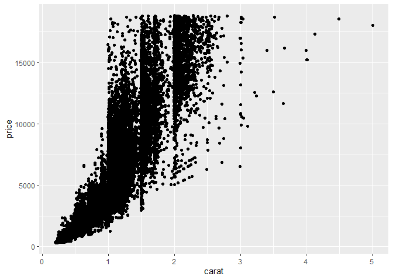
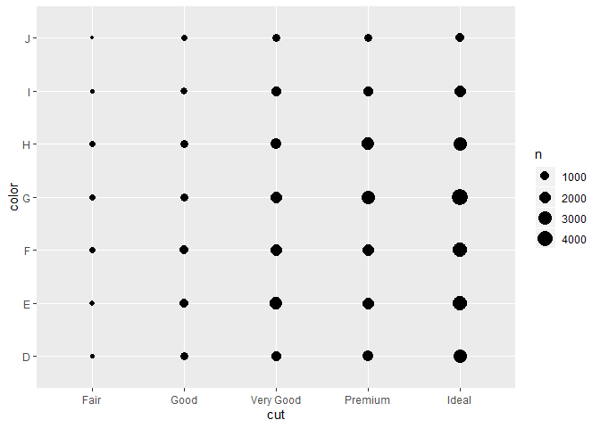
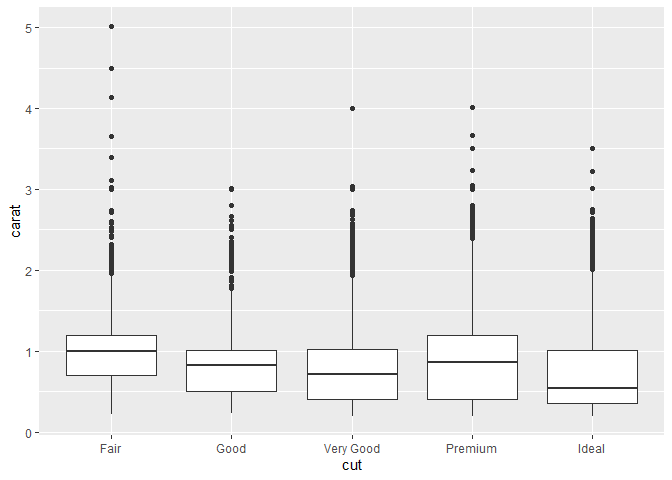
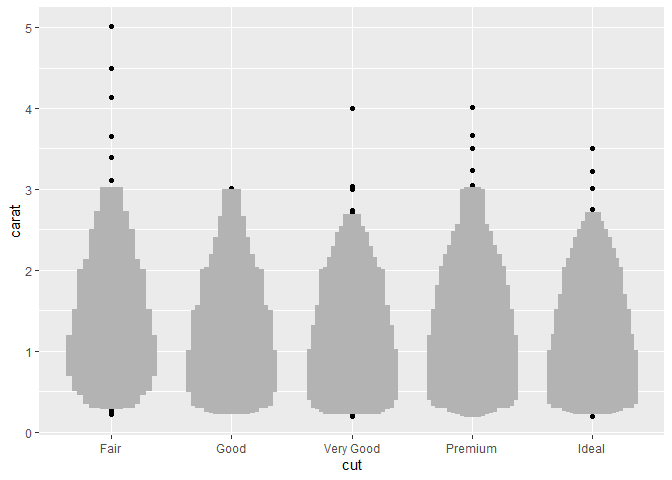

## Week 4  
R4DS Chapter 7 - Exploratory Data Analysis  
Read Sections 7.1 - 7.8 
Complete the following problems 
* 7.3.4 Problems 1-4  
* 7.4.1 Problems 1-2  
* 7.5.1.1 Problems 1-3, 5, 6 (explore ggbeeswarm, but you do not have to describe methods)  

Read sections 7.5.2-7.5.3 and describe an experiment that would fall into each of these categories (two categorical variables and two continuous variables). No exercises required.

R4DS Chapter 8 - Workflow: Projects
Read Sections 8.1 - 8.5

#### 7.3.4 Problems 1-4  

Question 1.

```r
ggplot(diamonds) +
  geom_histogram(mapping = aes(x = x), binwidth = 0.5)
```

<!-- -->

again, some at zero for x variable...


```r
ggplot(diamonds) +
  geom_histogram(mapping = aes(x = z), binwidth = 0.5)
```

<!-- -->


```r
ggplot(diamonds) +
  geom_histogram(mapping = aes(x = z), binwidth = 0.5) +
  coord_cartesian(ylim = 20)
```

<!-- -->


```r
diamonds %>%
  filter(z >10 | z<2)
```

```
## # A tibble: 24 x 10
##    carat cut       color clarity depth table price     x     y     z
##    <dbl> <ord>     <ord> <ord>   <dbl> <dbl> <int> <dbl> <dbl> <dbl>
##  1  1    Premium   G     SI2      59.1    59  3142  6.55  6.48  0   
##  2  1.01 Premium   H     I1       58.1    59  3167  6.66  6.6   0   
##  3  1.1  Premium   G     SI2      63      59  3696  6.5   6.47  0   
##  4  1.01 Premium   F     SI2      59.2    58  3837  6.5   6.47  0   
##  5  1.5  Good      G     I1       64      61  4731  7.15  7.04  0   
##  6  1.07 Ideal     F     SI2      61.6    56  4954  0     6.62  0   
##  7  1    Very Good H     VS2      63.3    53  5139  0     0     0   
##  8  1.15 Ideal     G     VS2      59.2    56  5564  6.88  6.83  0   
##  9  1.07 Ideal     F     SI1      60.6    57  5909  6.62  6.67  1.07
## 10  1.14 Fair      G     VS1      57.5    67  6381  0     0     0   
## # ... with 14 more rows
```

Question 2.  

```r
ggplot(diamonds) +
  geom_histogram(mapping = aes(price), binwidth = 10) +
  coord_cartesian( ylim = c(0, 100), xlim = c(0, 2000)
  )
```

<!-- -->

Question 3.  

```r
diamonds %>%
  filter(carat == 1) %>%
  count()
```

```
## # A tibble: 1 x 1
##       n
##   <int>
## 1  1558
```

```r
diamonds %>%
  filter(carat == .99) %>%
  count()
```

```
## # A tibble: 1 x 1
##       n
##   <int>
## 1    23
```

you can't sell that rounded up crap for jewelery!

Question 4. 


#### 7.4.1 Problems 1-2   

Question 1.  
For bar plots, NA becomes it's own category. For histograms, NAs are removed becuase they are outside the definition of continuous variables.  

Question 2. 

```r
c(NA, 2:10, 2600) %>%
  mean()
```

```
## [1] NA
```

```r
c(NA, 2:10, 2600) %>%
  mean(na.rm  = TRUE)
```

```
## [1] 265.4
```

####  7.5.1.1 Problems 1-3, 5, 6  

Question 1.  

```r
nycflights13::flights %>% 
  mutate(
    cancelled = is.na(dep_time),
    sched_hour = sched_dep_time %/% 100,
    sched_min = sched_dep_time %% 100,
    sched_dep_time = sched_hour + sched_min / 60
  ) %>% 
  ggplot(mapping = aes(y = sched_dep_time, x = cancelled)) + 
    geom_boxplot(mapping = aes(fill = cancelled)) +
  coord_flip()
```

<!-- -->

Question 2.  

```r
ggplot(diamonds, mapping = aes(cut, price)) +
  geom_jitter()
```

<!-- -->


```r
ggplot(diamonds, mapping = aes(carat, price)) +
  geom_jitter()
```

<!-- -->


```r
ggplot(diamonds, mapping = aes(cut, color)) +
         geom_count()
```

<!-- -->

Let's stick with carat  

```r
ggplot(diamonds, mapping = aes(cut, carat)) +
  geom_boxplot()
```

<!-- -->

carat trends negatively coorelated with cut  

Question 4.  

```r
library(lvplot)
ggplot(diamonds, mapping = aes(cut, carat)) +
  geom_lv()
```

<!-- -->

WOW hate this. 
