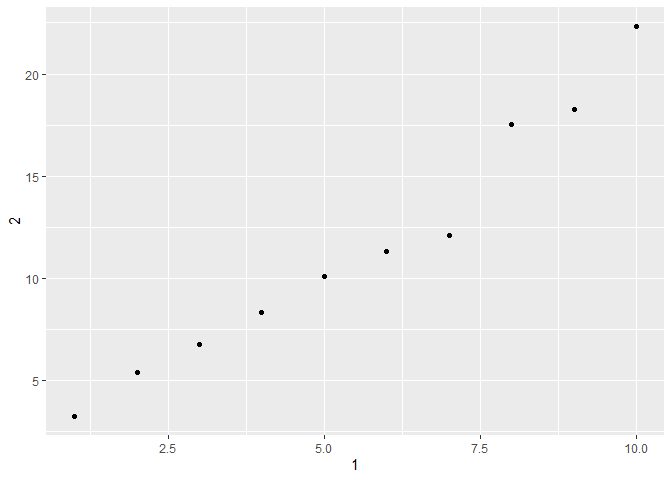
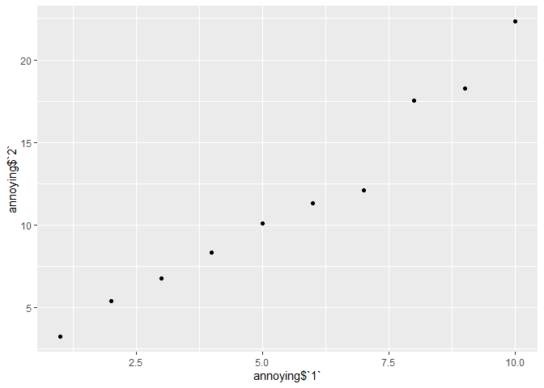

## Week 5 - R4DS Data Wrangling I  
### Week of May 18  

R4DS Chapter 9 - Introduction  

R4DS Chapter 10 - Tibbles  
* Read 10.1 - 10.4  
* 10.5 Problems 1-2, 4-5  

R4DS Chapter 11 - Data Import 
* Read 11.1 - 11.6  
* 11.2.2 Problems 1, 4 - 5  
* 11.3.5 Problems 1-3, 7  

#### Chapter 10 questions  

Question 1.  

```r
print(mtcars)
```

```
##                      mpg cyl  disp  hp drat    wt  qsec vs am gear carb
## Mazda RX4           21.0   6 160.0 110 3.90 2.620 16.46  0  1    4    4
## Mazda RX4 Wag       21.0   6 160.0 110 3.90 2.875 17.02  0  1    4    4
## Datsun 710          22.8   4 108.0  93 3.85 2.320 18.61  1  1    4    1
## Hornet 4 Drive      21.4   6 258.0 110 3.08 3.215 19.44  1  0    3    1
## Hornet Sportabout   18.7   8 360.0 175 3.15 3.440 17.02  0  0    3    2
## Valiant             18.1   6 225.0 105 2.76 3.460 20.22  1  0    3    1
## Duster 360          14.3   8 360.0 245 3.21 3.570 15.84  0  0    3    4
## Merc 240D           24.4   4 146.7  62 3.69 3.190 20.00  1  0    4    2
## Merc 230            22.8   4 140.8  95 3.92 3.150 22.90  1  0    4    2
## Merc 280            19.2   6 167.6 123 3.92 3.440 18.30  1  0    4    4
## Merc 280C           17.8   6 167.6 123 3.92 3.440 18.90  1  0    4    4
## Merc 450SE          16.4   8 275.8 180 3.07 4.070 17.40  0  0    3    3
## Merc 450SL          17.3   8 275.8 180 3.07 3.730 17.60  0  0    3    3
## Merc 450SLC         15.2   8 275.8 180 3.07 3.780 18.00  0  0    3    3
## Cadillac Fleetwood  10.4   8 472.0 205 2.93 5.250 17.98  0  0    3    4
## Lincoln Continental 10.4   8 460.0 215 3.00 5.424 17.82  0  0    3    4
## Chrysler Imperial   14.7   8 440.0 230 3.23 5.345 17.42  0  0    3    4
## Fiat 128            32.4   4  78.7  66 4.08 2.200 19.47  1  1    4    1
## Honda Civic         30.4   4  75.7  52 4.93 1.615 18.52  1  1    4    2
## Toyota Corolla      33.9   4  71.1  65 4.22 1.835 19.90  1  1    4    1
## Toyota Corona       21.5   4 120.1  97 3.70 2.465 20.01  1  0    3    1
## Dodge Challenger    15.5   8 318.0 150 2.76 3.520 16.87  0  0    3    2
## AMC Javelin         15.2   8 304.0 150 3.15 3.435 17.30  0  0    3    2
## Camaro Z28          13.3   8 350.0 245 3.73 3.840 15.41  0  0    3    4
## Pontiac Firebird    19.2   8 400.0 175 3.08 3.845 17.05  0  0    3    2
## Fiat X1-9           27.3   4  79.0  66 4.08 1.935 18.90  1  1    4    1
## Porsche 914-2       26.0   4 120.3  91 4.43 2.140 16.70  0  1    5    2
## Lotus Europa        30.4   4  95.1 113 3.77 1.513 16.90  1  1    5    2
## Ford Pantera L      15.8   8 351.0 264 4.22 3.170 14.50  0  1    5    4
## Ferrari Dino        19.7   6 145.0 175 3.62 2.770 15.50  0  1    5    6
## Maserati Bora       15.0   8 301.0 335 3.54 3.570 14.60  0  1    5    8
## Volvo 142E          21.4   4 121.0 109 4.11 2.780 18.60  1  1    4    2
```

```r
as_tibble(mtcars) %>%
  print()
```

```
## # A tibble: 32 x 11
##      mpg   cyl  disp    hp  drat    wt  qsec    vs    am  gear  carb
##    <dbl> <dbl> <dbl> <dbl> <dbl> <dbl> <dbl> <dbl> <dbl> <dbl> <dbl>
##  1  21       6  160    110  3.9   2.62  16.5     0     1     4     4
##  2  21       6  160    110  3.9   2.88  17.0     0     1     4     4
##  3  22.8     4  108     93  3.85  2.32  18.6     1     1     4     1
##  4  21.4     6  258    110  3.08  3.22  19.4     1     0     3     1
##  5  18.7     8  360    175  3.15  3.44  17.0     0     0     3     2
##  6  18.1     6  225    105  2.76  3.46  20.2     1     0     3     1
##  7  14.3     8  360    245  3.21  3.57  15.8     0     0     3     4
##  8  24.4     4  147.    62  3.69  3.19  20       1     0     4     2
##  9  22.8     4  141.    95  3.92  3.15  22.9     1     0     4     2
## 10  19.2     6  168.   123  3.92  3.44  18.3     1     0     4     4
## # ... with 22 more rows
```

hmm, there's definitely not row names in a tibble.  

Question 2.  

```r
df <- data.frame(abc = 1, xyz = "a")
df$x #called column xyz... weird
```

```
## [1] a
## Levels: a
```

```r
df[, "xyz"] 
```

```
## [1] a
## Levels: a
```

```r
df[, c("abc", "xyz")]
```

```
##   abc xyz
## 1   1   a
```


```r
tib <- tibble(abc = 1, xyz = "a")
tib$x #doesn't call anything
```

```
## Warning: Unknown or uninitialised column: `x`.
```

```
## NULL
```

```r
tib[, "xyz"] #easier to read here
```

```
## # A tibble: 1 x 1
##   xyz  
##   <chr>
## 1 a
```

```r
tib[, c("abc", "xyz")] # no thanks...
```

```
## # A tibble: 1 x 2
##     abc xyz  
##   <dbl> <chr>
## 1     1 a
```

Question 4.  

```r
annoying <- tibble(
  `1` = 1:10,
  `2` = `1` * 2 + rnorm(length(`1`))
)

select(annoying, `1`)
```

```
## # A tibble: 10 x 1
##      `1`
##    <int>
##  1     1
##  2     2
##  3     3
##  4     4
##  5     5
##  6     6
##  7     7
##  8     8
##  9     9
## 10    10
```

```r
ggplot(annoying, aes(x = `1`, `2`)) +
  geom_point()
```

<!-- -->

```r
ggplot(annoying, aes(x = annoying$`1`, y= annoying$`2`)) +
  geom_point()
```

```
## Warning: Use of `annoying$`1`` is discouraged. Use `1` instead.
```

```
## Warning: Use of `annoying$`2`` is discouraged. Use `2` instead.
```

<!-- -->

```r
annoying = annoying %>%
  mutate(`3` = `2` / `1`)

rename(annoying, 
       one = `1`,
       two = `2`, 
       three = `3`) %>%
  print()
```

```
## # A tibble: 10 x 3
##      one   two three
##    <int> <dbl> <dbl>
##  1     1  3.27  3.27
##  2     2  5.42  2.71
##  3     3  6.76  2.25
##  4     4  8.35  2.09
##  5     5 10.1   2.02
##  6     6 11.3   1.89
##  7     7 12.1   1.73
##  8     8 17.5   2.19
##  9     9 18.3   2.03
## 10    10 22.3   2.23
```

Question 5.  
enframe makes a tibble.  

```r
#from help file examples
enframe(c(a = 5, b = 7))
```

```
## # A tibble: 2 x 2
##   name  value
##   <chr> <dbl>
## 1 a         5
## 2 b         7
```

```r
enframe(list(one = 1, two = 2:3, three = 4:6)) #weird...
```

```
## # A tibble: 3 x 2
##   name  value    
##   <chr> <list>   
## 1 one   <dbl [1]>
## 2 two   <int [2]>
## 3 three <int [3]>
```

R4DS Chapter 11 - Data Import 
* Read 11.1 - 11.6  
* 11.2.2 Problems 1, 4 - 5  
* 11.3.5 Problems 1-3, 7  

#### Problems 11.2   
Question 1.  

```r
read_delim(delim = "|",
          "a|b|c\n1|2|.")
```

```
## # A tibble: 1 x 3
##       a     b c    
##   <dbl> <dbl> <chr>
## 1     1     2 .
```

Question 4.  

```r
read_csv("x,y\n1,'a,b'",
         quote = "'")
```

```
## # A tibble: 1 x 2
##       x y    
##   <dbl> <chr>
## 1     1 a,b
```

Question 5.  

```r
read_csv("a,b\n1,2,3\n4,5,6") #missing a header name so last column is dropped
```

```
## Warning: 2 parsing failures.
## row col  expected    actual         file
##   1  -- 2 columns 3 columns literal data
##   2  -- 2 columns 3 columns literal data
```

```
## # A tibble: 2 x 2
##       a     b
##   <dbl> <dbl>
## 1     1     2
## 2     4     5
```

```r
read_csv("a,b,c\n1,2\n1,2,3,4") #either new line out of place or misssing a col again. empty cells are filled with NA.
```

```
## Warning: 2 parsing failures.
## row col  expected    actual         file
##   1  -- 3 columns 2 columns literal data
##   2  -- 3 columns 4 columns literal data
```

```
## # A tibble: 2 x 3
##       a     b     c
##   <dbl> <dbl> <dbl>
## 1     1     2    NA
## 2     1     2     3
```

```r
read_csv("a,b\n\"1") #I'm not sure what this is supposed to be...
```

```
## Warning: 2 parsing failures.
## row col                     expected    actual         file
##   1  a  closing quote at end of file           literal data
##   1  -- 2 columns                    1 columns literal data
```

```
## # A tibble: 1 x 2
##       a b    
##   <dbl> <chr>
## 1     1 <NA>
```

```r
read_csv("a,b\n1,2\na,b") #??? 
```

```
## # A tibble: 2 x 2
##   a     b    
##   <chr> <chr>
## 1 1     2    
## 2 a     b
```

```r
read_csv("a;b\n1;3") # i think semicolons should be colons?
```

```
## # A tibble: 1 x 1
##   `a;b`
##   <chr>
## 1 1;3
```

#### Problems 11.3  
Question 1.  
all of the arguments seem important. For my work is is date_format.  

Question 2.  
```{}
locale(decimal_mark = ",", grouping_mark = ",")
Error: `decimal_mark` and `grouping_mark` must be different
```


```r
locale(decimal_mark = ",") #changes grouping to "."
```

```
## <locale>
## Numbers:  123.456,78
## Formats:  %AD / %AT
## Timezone: UTC
## Encoding: UTF-8
## <date_names>
## Days:   Sunday (Sun), Monday (Mon), Tuesday (Tue), Wednesday (Wed), Thursday
##         (Thu), Friday (Fri), Saturday (Sat)
## Months: January (Jan), February (Feb), March (Mar), April (Apr), May (May),
##         June (Jun), July (Jul), August (Aug), September (Sep), October
##         (Oct), November (Nov), December (Dec)
## AM/PM:  AM/PM
```

Question 3.  

```r
parse_date("2019_03_17", locale = locale(date_format = "%Y_%m_%d"))
```

```
## [1] "2019-03-17"
```

Question 7.  

```r
d1 <- parse_date("January 1, 2010", locale = locale(date_format = "%B %d, %Y"))
d2 <- parse_date("2015-Mar-07", locale = locale(date_format = "%Y-%b-%d"))
d3 <- parse_date("06-Jun-2017", locale = locale(date_format = "%d-%b-%Y"))
d4 <- parse_date(c("August 19 (2015)", "July 1 (2015)"), locale = locale(date_format = "%B %d (%Y)"))
d5 <- parse_date("12/30/14", locale = locale(date_format = "%m/%d/%y")) # Dec 30, 2014
(t1 <- parse_time("1705", locale = locale(time_format = "%H%M")))
```

```
## 17:05:00
```

```r
(t2 <- parse_time("11:15:10.12 PM", locale = locale(time_format = "%I:%M:%OS %p")))
```

```
## 23:15:10.12
```

DONE.
