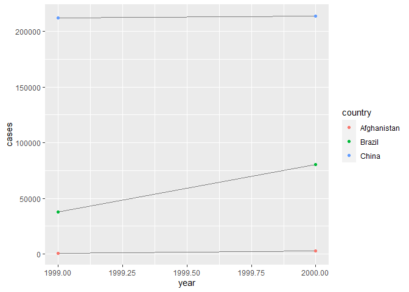
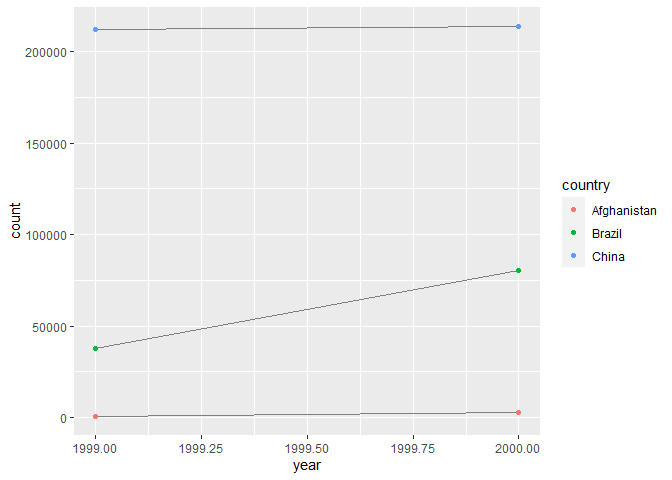
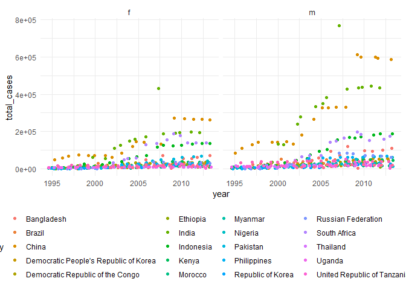

### Week 6 - Data Wrangling II  

R4DS Chapter 12 - Tidy Data   
Read 12.1 - 12.7  
12.2.1 Problems think about 1, complete 2 - 3  
12.3.3 Problems 1-4  
12.4.3 Problems 1-3  
12.6.1 Problems 3-4  
Joins tutorial (http://malooflab.phytonetworks.org/apps/joins-tutorial/)  

### Chapter 12  

> “Tidy datasets are all alike, but every messy dataset is messy in its own way.” –– Hadley Wickham  

#### 12.2.1 problems  
* 2 and 3 *  

Problem 2.  
Compute the rate for table2, and table4a + table4b.  


```r
#table 2
table2_cases = table2 %>%
  filter(type == "cases")
table2_pop = table2 %>%
  filter(type == "population")

table2_rate <- bind_cols(table2_cases, table2_pop) %>%
  mutate(case_rate = count/count1) %>%
  view()
```


```r
#table 4a and 4b

table4a$rate_1999 = table4a$`1999` / table4b$`1999`
table4a$rate_2000 = table4a$`2000` / table4b$`2000`
```

Problem 3.  

```r
ggplot(table1, aes(year, cases)) + 
  geom_line(aes(group = country), colour = "grey50") + 
  geom_point(aes(colour = country))
```

<!-- -->


```r
table2 %>%
  filter(type == "cases") %>%
  ggplot(aes(year, count)) +
    geom_line(aes(group = country), color = "grey50") +
    geom_point(aes(color = country))
```

<!-- -->

must filter cases data first!

#### 12.3.3 Problems 1-4  
Problem 1.  

```r
stocks <- tibble(
  year   = c(2015, 2015, 2016, 2016),
  half  = c(   1,    2,     1,    2),
  return = c(1.88, 0.59, 0.92, 0.17)
)
stocks %>% 
  pivot_wider(names_from = year, values_from = return) %>%
  pivot_longer(`2015`:`2016`, names_to = "year", values_to = "return", names_ptypes = list(year = factor())
               )
```

```
## # A tibble: 4 x 3
##    half year  return
##   <dbl> <fct>  <dbl>
## 1     1 2015    1.88
## 2     1 2016    0.92
## 3     2 2015    0.59
## 4     2 2016    0.17
```

column names must be characters so they must be manually cooreced as numbers after pivot_longer. chr to nmber isn't allowed through names_ptypes.  

Problem 2.  

```r
table4a %>% 
  pivot_longer(c(`1999`, `2000`), names_to = "year", values_to = "cases")
```

```
## # A tibble: 6 x 5
##   country     rate_1999 rate_2000 year   cases
##   <chr>           <dbl>     <dbl> <chr>  <int>
## 1 Afghanistan 0.0000373  0.000129 1999     745
## 2 Afghanistan 0.0000373  0.000129 2000    2666
## 3 Brazil      0.000219   0.000461 1999   37737
## 4 Brazil      0.000219   0.000461 2000   80488
## 5 China       0.000167   0.000167 1999  212258
## 6 China       0.000167   0.000167 2000  213766
```

```r
table4a
```

```
## # A tibble: 3 x 5
##   country     `1999` `2000` rate_1999 rate_2000
##   <chr>        <int>  <int>     <dbl>     <dbl>
## 1 Afghanistan    745   2666 0.0000373  0.000129
## 2 Brazil       37737  80488 0.000219   0.000461
## 3 China       212258 213766 0.000167   0.000167
```

needed back ticks around the coumn names because numbers are a mess.  

Problem 3.  

```r
people <- tribble(
  ~name,             ~names,  ~values,
  #-----------------|--------|------
  "Phillip Woods",   "age",       45,
  "Phillip Woods",   "height",   186,
  "Phillip Woods",   "age",       50,
  "Jessica Cordero", "age",       37,
  "Jessica Cordero", "height",   156
)
```

There are two individuals named Phillip Woods here and they cannot be distinguished with the current data. Add and ID number to make this work..


```r
people <- tribble(
  ~name,             ~names,  ~values, ~ID_number,
  #-----------------|--------|--------|-----------
  "Phillip Woods",   "age",       45,  12234,
  "Phillip Woods",   "height",   186,  12234,
  "Phillip Woods",   "age",       50,  33324,
  "Jessica Cordero", "age",       37,  55555,
  "Jessica Cordero", "height",   156,  55555
)

#could also use mutate to assign ID numbers in a new column.  

people %>%
  pivot_wider(names_from = names, values_from = values) %>%
  print
```

```
## # A tibble: 3 x 4
##   name            ID_number   age height
##   <chr>               <dbl> <dbl>  <dbl>
## 1 Phillip Woods       12234    45    186
## 2 Phillip Woods       33324    50     NA
## 3 Jessica Cordero     55555    37    156
```

Problem 4.  

```r
preg <- tribble(
  ~pregnant, ~male, ~female,
  "yes",     NA,    10,
  "no",      20,    12
)

#I want the columns to be sex, pregnant, not_pregnant

preg %>%
  pivot_longer(cols = c(male, female), names_to = "sex", values_to = "count") %>%
  pivot_wider(names_from = pregnant, values_from = count, names_prefix = "pregnant_")
```

```
## # A tibble: 2 x 3
##   sex    pregnant_yes pregnant_no
##   <chr>         <dbl>       <dbl>
## 1 male             NA          20
## 2 female           10          12
```

#### 12.4.3 Problems 1-3  

Problem 1.  

```r
tibble(x = c("a,b,c", "d,e,f,g", "h,i,j")) %>% 
  separate(x, c("one", "two", "three")) #gives a warning
```

```
## Warning: Expected 3 pieces. Additional pieces discarded in 1 rows [2].
```

```
## # A tibble: 3 x 3
##   one   two   three
##   <chr> <chr> <chr>
## 1 a     b     c    
## 2 d     e     f    
## 3 h     i     j
```

```r
tibble(x = c("a,b,c", "d,e,f,g", "h,i,j")) %>% 
  separate(x, c("one", "two", "three"), extra = "merge") #could also drop
```

```
## # A tibble: 3 x 3
##   one   two   three
##   <chr> <chr> <chr>
## 1 a     b     c    
## 2 d     e     f,g  
## 3 h     i     j
```

```r
tibble(x = c("a,b,c", "d,e", "f,g,i")) %>% 
  separate(x, c("one", "two", "three")) #gives a warning
```

```
## Warning: Expected 3 pieces. Missing pieces filled with `NA` in 1 rows [2].
```

```
## # A tibble: 3 x 3
##   one   two   three
##   <chr> <chr> <chr>
## 1 a     b     c    
## 2 d     e     <NA> 
## 3 f     g     i
```

```r
tibble(x = c("a,b,c", "d,e", "f,g,i")) %>% 
  separate(x, c("one", "two", "three"), fill = "left") #determines if NA leads or follows
```

```
## # A tibble: 3 x 3
##   one   two   three
##   <chr> <chr> <chr>
## 1 a     b     c    
## 2 <NA>  d     e    
## 3 f     g     i
```

Problem 2.  

```r
tibble(x = c("a,b,c", "d,e,f,g", "h,i,j")) %>% 
  separate(x, c("one", "two", "three"), remove = F, extra = "drop")
```

```
## # A tibble: 3 x 4
##   x       one   two   three
##   <chr>   <chr> <chr> <chr>
## 1 a,b,c   a     b     c    
## 2 d,e,f,g d     e     f    
## 3 h,i,j   h     i     j
```

remove = F keeps the original column(s). set to T by default.  

Problem 3.  
extract is similar but uses regex to separate, can't think of an example right now.... maybe hypenated names? uniting is easier than separating, less information to define.  

#### 12.6.1 Problems 3-4  

Problem 3.  

```r
who %>%
  unite("codes", c(country, iso2, iso3)) %>%
  count(codes) %>%
  nrow()
```

```
## [1] 219
```

```r
who %>%
  count(country) %>%
  nrow()
```

```
## [1] 219
```

Problem 4.  
For each country, year, and sex compute the total number of cases of TB. Make an informative visualisation of the data.  

```r
who_tidy = who %>%
  pivot_longer(
    cols = new_sp_m014:newrel_f65, 
    names_to = "key", 
    values_to = "cases", 
    values_drop_na = TRUE
  ) %>% 
  mutate(
    key = stringr::str_replace(key, "newrel", "new_rel")
  ) %>%
  separate(key, c("new", "var", "sexage")) %>% 
  select(-new, -iso2, -iso3) %>% 
  separate(sexage, c("sex", "age"), sep = 1)

who_summary <- who_tidy %>%
  group_by(country, year, sex) %>%
  summarise(total_cases = sum(cases, na.rm = T)) 
```

This is a TON of data, let's filter for the ton 10 countries by case load.  

```r
who_summary_ranked <- who_summary %>%
  group_by(country) %>%
  summarise(country_cases = sum(total_cases)) %>%
  mutate(rank = percent_rank(country_cases)) %>%
  arrange(desc(country_cases)) 
```

let's take the top 10% of countries for the plot. Based on this I should filter for country cases > 310000


```r
who_summary_ranked = who_summary_ranked %>%
  filter(country_cases > 310000)
```


```r
who_summary %>%
  filter(country %in% who_summary_ranked$country) %>%
  ggplot(aes(year, total_cases, color = country)) +
  geom_point(position = position_jitter(), a = .4) +
  facet_wrap(sex~.) +
  theme_minimal() + 
  theme(legend.position = "bottom")
```

```
## Warning: Ignoring unknown parameters: a
```

<!-- -->

